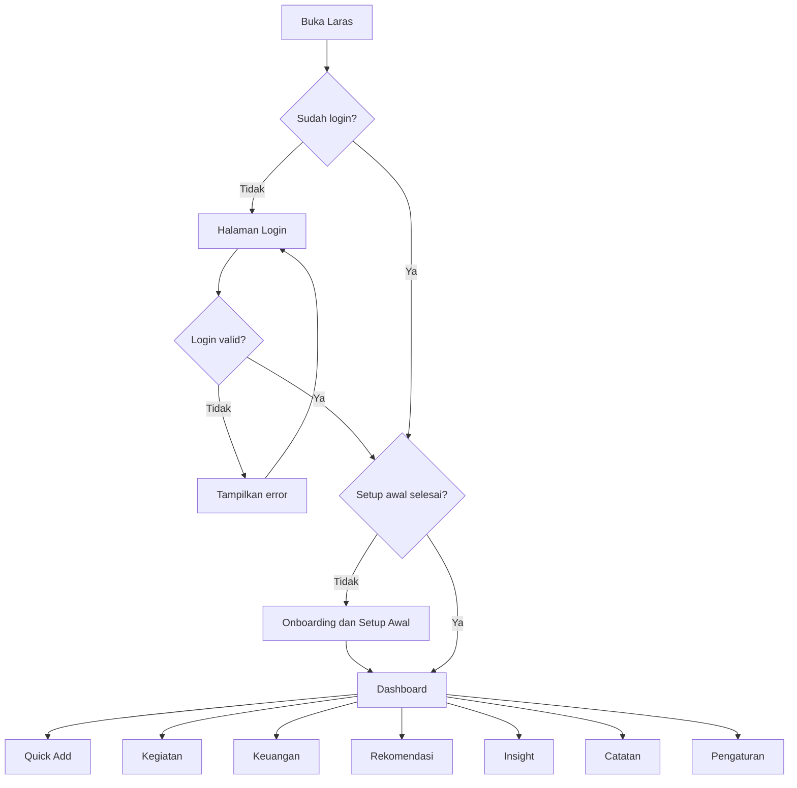
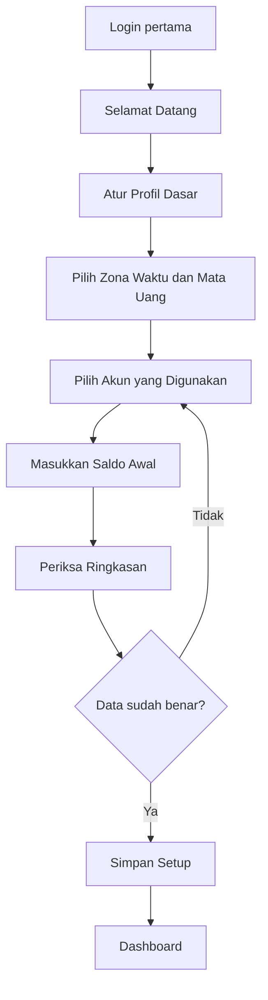
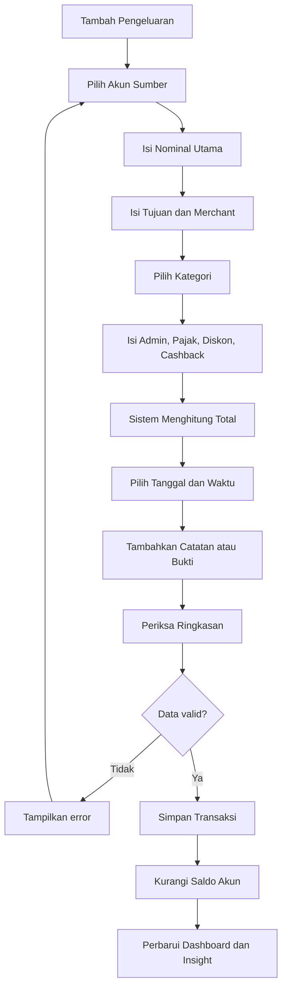
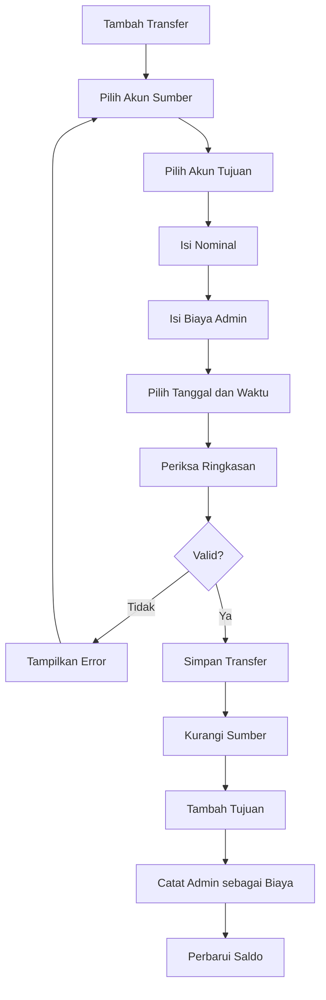
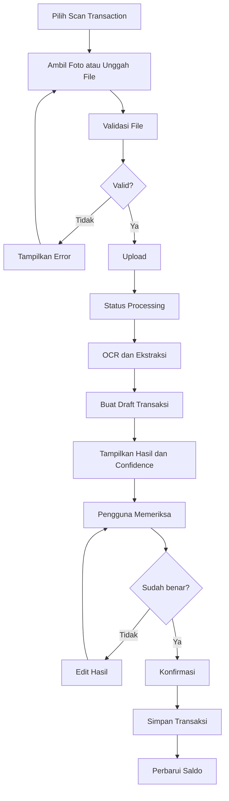

# User Flow — Laras

## 1. Informasi Dokumen

- **Nama proyek:** Laras
- **Tagline:** Selaraskan hari, tentukan langkah.
- **Jenis dokumen:** User Flow
- **Versi:** 1.0
- **Tanggal:** 31 Juli 2026
- **Dokumen terkait:** `01-project-scope.md`

---

## 2. Tujuan Dokumen

Dokumen ini menjelaskan alur penggunaan Laras dari sudut pandang pengguna.

User flow digunakan sebagai acuan untuk:

- Menentukan hubungan antarhalaman.
- Menentukan navigasi utama.
- Menentukan form dan aksi pengguna.
- Menentukan validasi dan konfirmasi.
- Menentukan respons sistem.
- Menentukan kondisi kosong, berhasil, gagal, dan membutuhkan pemeriksaan.
- Menjadi dasar pembuatan sitemap, wireframe, database, dan implementasi.

---

## 3. Aktor Sistem

Laras hanya memiliki satu aktor utama:

### Pengguna

Pengguna adalah pemilik aplikasi yang dapat:

- Login ke Laras.
- Mengelola kegiatan.
- Mengelola rekening dan saldo.
- Mencatat pemasukan dan pengeluaran.
- Melakukan transfer antar-akun.
- Mengunggah bukti transaksi.
- Meninjau hasil pemindaian.
- Melihat rekomendasi.
- Memberikan feedback.
- Melihat insight dan laporan.
- Mengatur preferensi aplikasi.

Tidak tersedia registrasi publik atau peran admin terpisah pada MVP.

---

## 4. Prinsip User Flow

Alur penggunaan Laras mengikuti prinsip berikut:

1. Setiap tindakan utama dapat diselesaikan dengan langkah sesedikit mungkin.
2. Quick Add selalu mudah diakses.
3. Data keuangan tidak boleh mengubah saldo sebelum transaksi valid dan dikonfirmasi.
4. Transfer antar-akun tidak dihitung sebagai pemasukan atau pengeluaran utama.
5. Rekomendasi harus memiliki alasan.
6. Hasil scan selalu menjadi draft sebelum dikonfirmasi.
7. Penghapusan data penting harus melalui konfirmasi.
8. Form menampilkan data utama terlebih dahulu dan detail tambahan secara opsional.
9. Kesalahan harus dijelaskan dengan bahasa yang mudah dipahami.
10. Pengguna selalu dapat kembali tanpa kehilangan data draft.

---

# 5. Alur Utama Aplikasi



---

# 6. Alur Opening Animation

## 6.1 Kondisi Tampil

Opening animation tampil ketika:

- Aplikasi dibuka untuk pertama kali pada sesi tersebut.
- Pengguna baru saja login.
- Pengguna memilih memutar ulang animasi dari pengaturan.

Opening animation tidak tampil penuh setiap kali berpindah halaman.

## 6.2 Alur

```text
Pengguna membuka Laras
→ Latar pembuka tampil
→ Logo Laras muncul
→ Elemen kegiatan, keuangan, dan insight menyatu
→ Tagline tampil
→ Sistem memeriksa status login
→ Pengguna diarahkan ke Login atau Dashboard
```

## 6.3 Kondisi Khusus

- Pengguna dapat melewati animasi.
- Jika `prefers-reduced-motion` aktif, sistem menampilkan versi sederhana.
- Jika animasi gagal dimuat, pengguna tetap diarahkan ke halaman berikutnya.
- Animasi tidak boleh menghambat autentikasi.

---

# 7. Alur Login

## 7.1 Login Berhasil

```text
Buka Laras
→ Halaman Login
→ Masukkan email
→ Masukkan password
→ Opsional: aktifkan Remember Me
→ Tekan Masuk
→ Sistem memvalidasi data
→ Login berhasil
→ Sistem mencatat login
→ Masuk ke Dashboard
```

## 7.2 Login Gagal

```text
Masukkan email atau password
→ Tekan Masuk
→ Sistem menemukan data tidak valid
→ Tampilkan pesan error
→ Pertahankan email
→ Kosongkan password
→ Pengguna mencoba kembali
```

## 7.3 Validasi Login

- Email wajib diisi.
- Format email harus valid.
- Password wajib diisi.
- Pesan error tidak boleh mengungkapkan apakah email terdaftar.
- Percobaan login berulang dapat dibatasi.

## 7.4 Logout

```text
Buka menu profil
→ Pilih Logout
→ Sistem meminta konfirmasi
→ Pengguna mengonfirmasi
→ Session dihapus
→ Aktivitas logout dicatat
→ Kembali ke halaman Login
```

---

# 8. Alur Onboarding dan Setup Awal

Onboarding hanya wajib dijalankan ketika aplikasi pertama kali digunakan atau setup belum selesai.

## 8.1 Tujuan Setup Awal

Setup awal digunakan untuk:

- Mengisi identitas dasar.
- Memilih zona waktu dan mata uang.
- Mengaktifkan akun keuangan awal.
- Memasukkan saldo awal.
- Menentukan tanggal saldo awal.
- Menentukan preferensi tampilan.

## 8.2 Alur Setup Awal



## 8.3 Akun Awal

Akun yang tersedia sebagai pilihan:

- BCA.
- Mandiri.
- BNI Pribadi.
- BNI Mahasiswa.
- SeaBank.
- Cash.

Pengguna dapat:

- Mengaktifkan semua akun.
- Menonaktifkan akun yang belum digunakan.
- Mengubah nama tampilan.
- Menambahkan akun lain.
- Menentukan warna dan ikon.

## 8.4 Input Saldo Awal

Untuk setiap akun aktif:

```text
Pilih akun
→ Masukkan saldo awal
→ Pilih tanggal saldo berlaku
→ Opsional: isi nomor rekening tersamarkan
→ Opsional: tentukan batas saldo minimum
→ Simpan
```

## 8.5 Validasi Saldo Awal

- Saldo wajib berupa angka valid.
- Saldo boleh nol.
- Tanggal saldo wajib diisi.
- Saldo awal tidak dianggap sebagai pemasukan.
- Akun yang tidak memiliki saldo tetap dapat disimpan dengan nilai nol.

---

# 9. Alur Dashboard

## 9.1 Saat Dashboard Dibuka

```text
Pengguna membuka Dashboard
→ Sistem mengambil data kegiatan hari ini
→ Sistem menghitung prioritas
→ Sistem menghitung saldo
→ Sistem mengambil transaksi terbaru
→ Sistem membuat atau mengambil rekomendasi aktif
→ Dashboard ditampilkan
```

## 9.2 Informasi Dashboard

Dashboard menampilkan:

- Sapaan berdasarkan waktu.
- Tanggal hari ini.
- Daily Focus.
- Kegiatan prioritas.
- Deadline terdekat.
- Ringkasan saldo.
- Pemasukan bulan berjalan.
- Pengeluaran bulan berjalan.
- Rekomendasi utama.
- Transaksi terbaru.
- Aktivitas terbaru.
- Tombol Quick Add.

## 9.3 Aksi Dashboard

Pengguna dapat:

- Membuka detail kegiatan.
- Menandai kegiatan selesai.
- Membuka detail transaksi.
- Membuka rekening.
- Menindaklanjuti rekomendasi.
- Membuka Quick Add.
- Melihat semua aktivitas.
- Melihat semua transaksi.
- Menyembunyikan informasi saldo.

---

# 10. Alur Quick Add

## 10.1 Membuka Quick Add

```text
Tekan tombol Quick Add
→ Pilih jenis data
→ Form ringkas terbuka
→ Isi data utama
→ Opsional: buka Detail Tambahan
→ Simpan
→ Sistem memvalidasi
→ Data disimpan
→ Tampilkan notifikasi berhasil
```

Jenis Quick Add:

- Kegiatan.
- Pengeluaran.
- Pemasukan.
- Transfer.
- Catatan.
- Penyesuaian saldo.
- Scan bukti transaksi.

## 10.2 Menutup Quick Add

Jika form belum diisi:

```text
Tekan Tutup
→ Form ditutup
```

Jika form sudah diisi:

```text
Tekan Tutup
→ Sistem menanyakan apakah draft disimpan
→ Pilih Simpan Draft, Buang, atau Kembali
```

---

# 11. Alur Manajemen Kegiatan

## 11.1 Menambahkan Kegiatan

```text
Buka Quick Add atau halaman Activities
→ Pilih Tambah Kegiatan
→ Isi judul
→ Pilih kategori
→ Tentukan tingkat kepentingan
→ Tentukan tingkat dampak
→ Tentukan deadline
→ Isi estimasi durasi
→ Opsional: isi deskripsi dan jadwal
→ Tekan Simpan
→ Sistem memvalidasi
→ Sistem menghitung skor prioritas
→ Kegiatan disimpan
→ Rekomendasi terkait dapat dibuat
→ Tampilkan detail atau kembali ke daftar
```

## 11.2 Form Ringkas Kegiatan

Data utama:

- Judul.
- Deadline.
- Tingkat kepentingan.
- Estimasi durasi.

Detail tambahan:

- Deskripsi.
- Kategori.
- Tingkat dampak.
- Tanggal mulai.
- Waktu pengerjaan.
- Catatan.

## 11.3 Melihat Daftar Kegiatan

```text
Buka Activities
→ Sistem menampilkan kegiatan
→ Urutkan default berdasarkan prioritas
→ Pengguna dapat mencari, memfilter, atau mengubah urutan
```

Filter:

- Hari ini.
- Mendatang.
- Terlambat.
- Selesai.
- Ditunda.
- Dibatalkan.
- Kategori.
- Prioritas.
- Deadline.

## 11.4 Membuka Detail Kegiatan

```text
Pilih kegiatan
→ Detail kegiatan terbuka
→ Lihat skor dan alasan prioritas
→ Lihat status
→ Lihat timeline perubahan
→ Pilih aksi
```

Aksi:

- Mulai.
- Selesaikan.
- Tunda.
- Jadwalkan ulang.
- Edit.
- Batalkan.
- Hapus.

## 11.5 Memulai Kegiatan

```text
Tekan Mulai
→ Status menjadi In Progress
→ Waktu mulai dicatat
→ Sistem memperbarui prioritas
→ Dashboard diperbarui
```

## 11.6 Menyelesaikan Kegiatan

```text
Tekan Selesaikan
→ Opsional: isi durasi sebenarnya
→ Opsional: isi catatan hasil
→ Konfirmasi
→ Status menjadi Completed
→ Waktu selesai dicatat
→ Prioritas tidak lagi aktif
→ Aktivitas dicatat
→ Sistem dapat membuat insight
```

## 11.7 Menunda Kegiatan

```text
Tekan Tunda
→ Pilih tanggal atau waktu baru
→ Isi alasan opsional
→ Konfirmasi
→ Jumlah penundaan bertambah
→ Deadline atau jadwal diperbarui
→ Skor prioritas dihitung ulang
→ Sistem dapat membuat rekomendasi
```

## 11.8 Membatalkan Kegiatan

```text
Tekan Batalkan
→ Isi alasan opsional
→ Konfirmasi
→ Status menjadi Cancelled
→ Aktivitas dicatat
```

## 11.9 Menghapus Kegiatan

```text
Tekan Hapus
→ Sistem menampilkan dampak penghapusan
→ Konfirmasi
→ Kegiatan diarsipkan atau soft delete
→ Aktivitas dicatat
```

---

# 12. Alur Sistem Prioritas

## 12.1 Perhitungan Prioritas

Perhitungan dilakukan ketika:

- Kegiatan dibuat.
- Kegiatan diedit.
- Deadline berubah.
- Status berubah.
- Kegiatan ditunda.
- Hari atau waktu berubah.
- Sistem menjalankan pembaruan terjadwal.

## 12.2 Alur

```text
Sistem membaca data kegiatan
→ Menghitung skor kepentingan
→ Menghitung skor dampak
→ Menghitung kedekatan deadline
→ Menghitung jumlah penundaan
→ Menghitung estimasi durasi
→ Menghasilkan skor total
→ Menentukan level prioritas
→ Menyimpan alasan
→ Menampilkan hasil
```

## 12.3 Tampilan Hasil

Contoh:

```text
Prioritas: High
Skor: 74

Alasan:
- Deadline kurang dari dua hari.
- Dampak kegiatan tinggi.
- Kegiatan sudah ditunda satu kali.
```

---

# 13. Alur Manajemen Rekening

## 13.1 Melihat Daftar Rekening

```text
Buka Finance
→ Pilih Accounts
→ Sistem menampilkan seluruh akun
→ Tampilkan saldo setiap akun
→ Tampilkan total saldo
```

## 13.2 Menambahkan Rekening

```text
Tekan Tambah Akun
→ Pilih jenis akun
→ Isi nama akun
→ Isi institusi
→ Isi label atau fungsi
→ Masukkan saldo awal
→ Pilih tanggal saldo awal
→ Opsional: nomor rekening tersamarkan
→ Pilih warna dan ikon
→ Tentukan batas saldo minimum
→ Simpan
→ Akun muncul pada daftar
```

## 13.3 Mengedit Rekening

```text
Buka detail akun
→ Tekan Edit
→ Ubah data yang diperbolehkan
→ Simpan
→ Sistem memvalidasi
→ Data akun diperbarui
```

Saldo tidak diedit melalui form akun.

## 13.4 Menonaktifkan Rekening

```text
Buka detail akun
→ Tekan Nonaktifkan
→ Sistem memeriksa transaksi aktif
→ Konfirmasi
→ Akun tidak muncul pada form transaksi baru
→ Riwayat tetap tersedia
```

## 13.5 Mengaktifkan Kembali

```text
Buka daftar akun nonaktif
→ Pilih akun
→ Tekan Aktifkan
→ Akun kembali tersedia
```

---

# 14. Alur Pengeluaran

## 14.1 Menambahkan Pengeluaran Manual



## 14.2 Data Utama Pengeluaran

- Akun sumber.
- Nominal utama.
- Tujuan.
- Merchant atau penerima.
- Kategori.
- Tingkat kebutuhan.
- Tanggal.
- Waktu.

## 14.3 Detail Tambahan

- Biaya administrasi.
- Pajak.
- Diskon.
- Cashback.
- Metode pembayaran.
- Nomor referensi.
- Lokasi.
- Catatan.
- Bukti pembayaran.

## 14.4 Perhitungan Total

```text
Total keluar =
Nominal utama
+ biaya administrasi
+ pajak
- diskon
- cashback langsung
```

## 14.5 Validasi Pengeluaran

- Akun sumber wajib dipilih.
- Nominal utama harus lebih dari nol.
- Biaya tidak boleh negatif.
- Total tidak boleh negatif.
- Saldo sumber harus mencukupi, kecuali sistem mengizinkan saldo negatif.
- Transaksi `Draft`, `Pending`, `Failed`, atau `Cancelled` tidak mengurangi saldo final.
- Bukti transaksi bersifat opsional pada input manual.

## 14.6 Saldo Tidak Cukup

```text
Sistem mendeteksi saldo tidak cukup
→ Tampilkan saldo tersedia
→ Tampilkan total transaksi
→ Berikan pilihan:
   - Ubah akun sumber
   - Kurangi nominal
   - Simpan sebagai draft
   - Batalkan
```

---

# 15. Alur Pemasukan

## 15.1 Menambahkan Pemasukan

```text
Pilih Tambah Pemasukan
→ Pilih akun penerima
→ Isi nominal
→ Pilih sumber pemasukan
→ Pilih kategori
→ Isi nama pengirim
→ Pilih tanggal dan waktu
→ Opsional: nomor referensi, catatan, bukti
→ Periksa ringkasan
→ Simpan
→ Saldo akun bertambah
→ Dashboard diperbarui
```

## 15.2 Validasi Pemasukan

- Akun penerima wajib dipilih.
- Nominal harus lebih dari nol.
- Status harus `Completed` agar saldo bertambah.
- Refund dapat dikaitkan dengan transaksi sebelumnya.

---

# 16. Alur Transfer Antar-Akun

## 16.1 Transfer Berhasil



## 16.2 Validasi Transfer

- Sumber dan tujuan wajib berbeda.
- Nominal lebih dari nol.
- Saldo sumber mencukupi untuk nominal dan biaya admin.
- Akun sumber dan tujuan harus aktif.
- Transfer gagal tidak mengubah saldo tujuan.
- Transfer pending tidak mengubah saldo final atau diperlakukan sesuai kebijakan status.

## 16.3 Perhitungan

```text
Pengurangan akun sumber = nominal transfer + biaya admin
Penambahan akun tujuan  = nominal transfer
Perubahan total kekayaan = -biaya admin
```

## 16.4 Membuka Detail Transfer

Detail menampilkan:

- Akun sumber.
- Akun tujuan.
- Nominal.
- Biaya admin.
- Saldo sebelum dan sesudah.
- Status.
- Nomor referensi.
- Bukti.
- Hubungan transaksi keluar dan masuk.

---

# 17. Alur Penyesuaian Saldo

## 17.1 Membuat Penyesuaian

```text
Buka detail akun
→ Pilih Sesuaikan Saldo
→ Sistem menampilkan saldo saat ini
→ Masukkan saldo aktual
→ Sistem menghitung selisih
→ Isi alasan wajib
→ Pilih tanggal
→ Konfirmasi
→ Transaksi penyesuaian dibuat
→ Saldo diperbarui
→ Aktivitas dicatat
```

## 17.2 Validasi

- Alasan wajib diisi.
- Nilai sebelum dan sesudah disimpan.
- Penyesuaian tidak menghapus transaksi lama.
- Penyesuaian besar dapat memerlukan konfirmasi tambahan.

---

# 18. Alur Riwayat Transaksi

## 18.1 Membuka Riwayat

```text
Buka Finance
→ Pilih Transaction History
→ Sistem menampilkan transaksi terbaru
→ Pengguna dapat mencari, memfilter, dan mengurutkan
```

## 18.2 Filter

- Akun.
- Jenis transaksi.
- Kategori.
- Merchant.
- Penerima.
- Pengirim.
- Tanggal.
- Nominal.
- Status.
- Metode pembayaran.
- Sumber input.
- Dengan atau tanpa bukti.
- Dengan admin atau pajak.

## 18.3 Detail Transaksi

```text
Pilih transaksi
→ Lihat detail
→ Lihat saldo sebelum
→ Lihat perubahan
→ Lihat saldo setelah
→ Lihat lampiran
→ Lihat audit trail
→ Pilih aksi
```

Aksi:

- Edit.
- Tambah atau ganti bukti.
- Tandai refund.
- Batalkan.
- Hapus atau arsipkan.
- Duplikasi sebagai transaksi baru.

## 18.4 Edit Transaksi

```text
Tekan Edit
→ Form menampilkan data lama
→ Ubah data
→ Sistem menghitung ulang dampak saldo
→ Tampilkan ringkasan perubahan
→ Konfirmasi
→ Simpan
→ Saldo dihitung ulang
→ Audit trail disimpan
```

## 18.5 Hapus Transaksi

```text
Tekan Hapus
→ Sistem menjelaskan dampak terhadap saldo
→ Pengguna mengonfirmasi
→ Transaksi diarsipkan atau soft delete
→ Saldo dihitung ulang
→ Aktivitas dicatat
```

---

# 19. Alur Lampiran Bukti Transaksi

## 19.1 Menambahkan Lampiran

```text
Buka form atau detail transaksi
→ Pilih Tambah Bukti
→ Ambil foto atau pilih file
→ Sistem memvalidasi tipe dan ukuran
→ Tampilkan preview
→ Pengguna mengonfirmasi
→ File disimpan secara privat
→ Lampiran terhubung ke transaksi
```

## 19.2 Validasi File

- Format diperbolehkan.
- Ukuran tidak melebihi batas.
- Nama file diamankan.
- File rusak ditolak.
- File sensitif tidak disimpan di folder publik.

## 19.3 Menghapus Lampiran

```text
Pilih lampiran
→ Tekan Hapus
→ Konfirmasi
→ Lampiran dihapus
→ Transaksi tetap tersimpan
```

---

# 20. Alur Scan Bukti Transaksi

## 20.1 Memulai Scan



## 20.2 Jenis Dokumen

- Struk pembelian.
- Bukti transfer.
- Bukti pembayaran.
- Screenshot mobile banking.
- Screenshot e-wallet.
- Nota.
- Invoice.
- Dokumen lainnya.

## 20.3 Hasil Ekstraksi

Sistem mencoba membaca:

- Merchant.
- Penerima.
- Pengirim.
- Tanggal.
- Waktu.
- Nominal.
- Admin.
- Pajak.
- Diskon.
- Cashback.
- Total.
- Referensi.
- Bank atau layanan.
- Akun sumber.
- Akun tujuan.
- Metode pembayaran.
- Deskripsi.

## 20.4 Pemeriksaan Hasil

Setiap field menampilkan:

- Nilai hasil baca.
- Confidence score.
- Penanda perlu diperiksa.
- Nilai asli hasil OCR jika diperlukan.

## 20.5 Aturan Confidence

Contoh aturan awal:

```text
90–100% : Tinggi
70–89%  : Sedang
0–69%   : Rendah
```

- Confidence tinggi dapat langsung mengisi form.
- Confidence sedang diberi tanda.
- Confidence rendah wajib diperiksa.
- Semua hasil tetap membutuhkan konfirmasi final.

## 20.6 Scan Gagal

```text
OCR gagal membaca dokumen
→ Tampilkan alasan umum
→ Berikan pilihan:
   - Ambil foto ulang
   - Unggah file lain
   - Isi transaksi secara manual
   - Simpan dokumen untuk diperiksa nanti
```

## 20.7 Draft Scan

Draft dapat:

- Dilanjutkan.
- Diedit.
- Ditolak.
- Dihapus.
- Diubah menjadi transaksi manual.

Saldo tidak berubah selama status masih draft.

---

# 21. Alur Kategori

## 21.1 Menambahkan Kategori

```text
Buka Settings atau halaman kategori
→ Pilih jenis kategori
→ Isi nama
→ Pilih ikon
→ Pilih warna
→ Opsional: isi anggaran
→ Simpan
```

## 21.2 Menonaktifkan Kategori

```text
Pilih kategori
→ Tekan Nonaktifkan
→ Kategori tidak tersedia pada input baru
→ Data lama tetap menggunakan kategori tersebut
```

Kategori yang sudah digunakan tidak dihapus permanen.

---

# 22. Alur Anggaran

## 22.1 Membuat Anggaran

```text
Buka Finance
→ Pilih Budgets
→ Tekan Tambah Anggaran
→ Pilih kategori
→ Isi nominal
→ Pilih periode
→ Pilih tanggal mulai dan selesai
→ Simpan
→ Sistem mulai menghitung penggunaan
```

## 22.2 Pemantauan Anggaran

```text
Transaksi pengeluaran disimpan
→ Sistem memeriksa kategori
→ Sistem menambahkan penggunaan
→ Hitung persentase
→ Tentukan status
→ Jika mendekati atau melewati batas, buat rekomendasi
```

## 22.3 Status

- Aman.
- Mendekati batas.
- Melebihi batas.

---

# 23. Alur Rekomendasi

## 23.1 Pembuatan Rekomendasi

Rekomendasi dapat dibuat ketika:

- Dashboard dibuka.
- Kegiatan dibuat atau diubah.
- Deadline mendekat.
- Kegiatan ditunda.
- Transaksi disimpan.
- Anggaran berubah.
- Saldo rendah.
- Biaya admin meningkat.
- Draft scan belum ditinjau.
- Sistem menjalankan proses terjadwal.

## 23.2 Alur Sistem

```text
Sistem membaca data terbaru
→ Memeriksa aturan
→ Menentukan apakah rekomendasi diperlukan
→ Menghindari duplikasi
→ Membuat rekomendasi
→ Menentukan prioritas
→ Menyimpan alasan
→ Menampilkan rekomendasi
```

## 23.3 Menindaklanjuti Rekomendasi

```text
Buka rekomendasi
→ Baca saran dan alasan
→ Pilih respons
```

Respons:

- Ikuti.
- Jadwalkan.
- Tunda.
- Abaikan.
- Tidak relevan.

## 23.4 Respons Ikuti

```text
Tekan Ikuti
→ Sistem menjalankan aksi yang diizinkan atau membuka form terkait
→ Pengguna mengonfirmasi
→ Status menjadi Followed
→ Hasil dicatat
```

## 23.5 Respons Jadwalkan

```text
Tekan Jadwalkan
→ Pilih tanggal dan waktu
→ Simpan
→ Status menjadi Scheduled
→ Kegiatan atau pengingat dibuat
```

## 23.6 Respons Tidak Relevan

```text
Tekan Tidak Relevan
→ Opsional: isi alasan
→ Simpan feedback
→ Status menjadi Not Relevant
→ Data digunakan untuk penyesuaian rekomendasi berikutnya
```

---

# 24. Alur Insight

## 24.1 Membuka Insight

```text
Buka Insights
→ Pilih Productivity atau Financial
→ Pilih periode
→ Sistem menghitung data
→ Tampilkan ringkasan, grafik, dan insight
```

## 24.2 Insight Produktivitas

Pengguna dapat melihat:

- Kegiatan selesai.
- Kegiatan tertunda.
- Completion rate.
- Hari produktif.
- Jam produktif.
- Kategori terbanyak.
- Estimasi vs durasi aktual.
- Pola penundaan.

## 24.3 Insight Keuangan

Pengguna dapat melihat:

- Total saldo.
- Pemasukan.
- Pengeluaran.
- Pengeluaran per kategori.
- Pengeluaran per akun.
- Pengeluaran per merchant.
- Admin dan pajak.
- Diskon dan cashback.
- Anggaran.
- Perbandingan periode.

## 24.4 Kondisi Data Belum Cukup

```text
Data belum mencukupi
→ Tampilkan empty state
→ Jelaskan data apa yang diperlukan
→ Berikan tombol untuk menambah data
```

---

# 25. Alur Catatan

## 25.1 Menambahkan Catatan

```text
Buka Quick Add
→ Pilih Catatan
→ Isi judul opsional
→ Isi catatan
→ Pilih kategori opsional
→ Simpan
```

## 25.2 Mengelola Catatan

Pengguna dapat:

- Mencari.
- Mengedit.
- Menghapus.
- Menyematkan.
- Memfilter kategori.

---

# 26. Alur Pengaturan

## 26.1 Pengaturan Profil

Pengguna dapat mengubah:

- Nama.
- Email.
- Foto profil.
- Zona waktu.
- Mata uang.
- Format tanggal.
- Bahasa jika tersedia.

## 26.2 Tampilan

Pengguna dapat memilih:

- Light mode.
- Dark mode.
- Mengikuti sistem.
- Mengurangi animasi.
- Menampilkan atau menyembunyikan saldo.
- Memutar ulang opening animation.

## 26.3 Preferensi Keuangan

Pengguna dapat mengatur:

- Akun utama.
- Batas saldo minimum.
- Mata uang.
- Format nominal.
- Periode anggaran.
- Kategori default.
- Metode pembayaran default.

## 26.4 Preferensi Kegiatan

Pengguna dapat mengatur:

- Durasi default.
- Tingkat kepentingan default.
- Waktu produktif.
- Pengingat deadline.
- Kategori default.

## 26.5 Keamanan

Pengguna dapat:

- Mengubah password.
- Mengakhiri session.
- Mengaktifkan PIN pada tahap lanjutan.
- Melihat aktivitas login.
- Mengelola backup.

---

# 27. Navigasi Desktop

Struktur navigasi desktop:

```text
Sidebar
├── Dashboard
├── Activities
├── Finance
│   ├── Overview
│   ├── Accounts
│   ├── Transactions
│   ├── Income
│   ├── Expenses
│   ├── Transfers
│   ├── Budgets
│   └── Scan Transaction
├── Recommendations
├── Insights
├── Notes
└── Settings
```

Quick Add berada pada:

- Sidebar atau header.
- Tombol mengambang.
- Keyboard shortcut.

---

# 28. Navigasi Mobile

Bottom navigation:

```text
Home | Activities | Add | Finance | Insights
```

Menu tambahan tersedia melalui:

- Menu profil.
- More menu.
- Drawer atau bottom sheet.

Quick Add membuka bottom sheet.

Form panjang dibagi menjadi:

- Data utama.
- Detail tambahan.
- Ringkasan.
- Konfirmasi.

---

# 29. Global Search

## 29.1 Membuka Pencarian

```text
Tekan kolom pencarian atau shortcut
→ Masukkan kata kunci
→ Sistem mencari kegiatan, transaksi, merchant, akun, dan catatan
→ Hasil dikelompokkan berdasarkan jenis
→ Pilih hasil
→ Buka detail
```

## 29.2 Empty State

```text
Tidak ada hasil
→ Tampilkan kata kunci
→ Berikan saran filter atau penulisan
```

---

# 30. Notifikasi Dalam Aplikasi

Notifikasi dapat muncul untuk:

- Deadline mendekat.
- Kegiatan terlambat.
- Saldo rendah.
- Anggaran hampir habis.
- Anggaran terlampaui.
- Draft scan belum dikonfirmasi.
- Transaksi gagal.
- Penyesuaian saldo.
- Rekomendasi baru.

Aksi notifikasi:

- Buka.
- Tandai dibaca.
- Tunda.
- Hapus.

Push notification belum termasuk MVP inti.

---

# 31. Kondisi Loading

Loading state digunakan saat:

- Memuat dashboard.
- Mengambil transaksi.
- Menghitung insight.
- Memproses scan.
- Mengunggah file.
- Menyimpan data.

Tampilan:

- Skeleton untuk kartu dan daftar.
- Progress indicator untuk upload dan scan.
- Tombol dalam kondisi disabled saat proses simpan.

Pengguna tidak boleh dapat mengirim form berulang kali selama proses berlangsung.

---

# 32. Kondisi Empty State

Empty state utama:

## 32.1 Belum Ada Kegiatan

```text
Belum ada kegiatan.
Tambahkan kegiatan pertama agar Laras dapat membantu menentukan prioritas.
```

## 32.2 Belum Ada Transaksi

```text
Belum ada transaksi.
Mulai catat pemasukan atau pengeluaranmu.
```

## 32.3 Belum Ada Rekomendasi

```text
Belum ada rekomendasi.
Laras membutuhkan lebih banyak data untuk memberikan saran.
```

## 32.4 Belum Ada Insight

```text
Insight belum tersedia.
Gunakan Laras secara rutin agar pola mulai terlihat.
```

---

# 33. Kondisi Error

## 33.1 Error Validasi

- Field ditandai.
- Pesan muncul dekat field.
- Data lain tidak hilang.
- Fokus diarahkan ke error pertama.

## 33.2 Error Server

```text
Terjadi kesalahan saat memproses data
→ Data form dipertahankan
→ Tampilkan tombol Coba Lagi
→ Berikan opsi Simpan Draft jika memungkinkan
```

## 33.3 Koneksi Terputus

```text
Koneksi terputus
→ Tampilkan status offline
→ Cegah transaksi final yang membutuhkan server
→ Simpan draft lokal jika memungkinkan
→ Sinkronkan setelah online pada tahap lanjutan
```

## 33.4 Konflik Data

```text
Data berubah dari sesi lain
→ Tampilkan perbandingan
→ Pilih Muat Ulang atau Tetap Simpan
```

---

# 34. Konfirmasi Tindakan Penting

Konfirmasi wajib untuk:

- Logout.
- Menghapus kegiatan.
- Menghapus transaksi.
- Membatalkan transaksi.
- Menonaktifkan akun.
- Penyesuaian saldo.
- Mengubah transaksi yang memengaruhi saldo.
- Menyimpan hasil scan.
- Menghapus bukti transaksi.
- Mengatur ulang data.

Konfirmasi menampilkan:

- Tindakan.
- Dampak.
- Data yang terpengaruh.
- Tombol batal yang jelas.

---

# 35. Audit Trail

Aktivitas yang dicatat:

```text
Aksi pengguna
→ Sistem menyimpan jenis aksi
→ Sistem menyimpan data sebelum dan sesudah
→ Sistem menyimpan waktu
→ Sistem menyimpan metadata
→ Log dapat dilihat pada detail terkait
```

Audit trail terutama berlaku untuk:

- Transaksi.
- Saldo.
- Transfer.
- Rekening.
- Hasil scan.
- Kegiatan.
- Rekomendasi.

---

# 36. User Flow Harian Ideal

Contoh alur penggunaan sehari-hari:

```text
Pagi:
Buka Laras
→ Lihat kegiatan prioritas
→ Lihat saldo dan peringatan
→ Ikuti rekomendasi utama
→ Mulai kegiatan

Siang:
Buka Quick Add
→ Catat pengeluaran makan
→ Pilih akun BCA
→ Tambahkan merchant dan pajak
→ Simpan

Sore:
Buka Activities
→ Tandai kegiatan selesai
→ Isi durasi aktual
→ Lihat prioritas berikutnya

Malam:
Buka Scan Transaction
→ Unggah bukti transfer
→ Periksa hasil OCR
→ Konfirmasi transaksi
→ Lihat ringkasan harian
```

---

# 37. User Flow Mingguan Ideal

```text
Buka Insights
→ Pilih periode Minggu Ini
→ Lihat completion rate
→ Lihat pengeluaran per kategori
→ Lihat total biaya admin
→ Baca rekomendasi mingguan
→ Atur kegiatan dan anggaran minggu berikutnya
```

---

# 38. Alur Sistem Adaptif Masa Depan

Fitur ini belum menjadi bagian implementasi awal.

```text
Pengguna menggunakan Laras
→ Sistem menyimpan pola tindakan
→ Sistem membaca waktu produktif
→ Sistem membaca kegiatan yang sering ditunda
→ Sistem membaca rekomendasi yang diikuti
→ Sistem membaca pola pengeluaran
→ Sistem menyesuaikan bobot
→ Rekomendasi berikutnya menjadi lebih personal
```

Data yang dapat digunakan:

- Waktu kegiatan dibuat.
- Waktu kegiatan dimulai.
- Waktu kegiatan selesai.
- Jumlah penundaan.
- Durasi estimasi.
- Durasi aktual.
- Respons rekomendasi.
- Kategori pengeluaran.
- Frekuensi merchant.
- Penggunaan akun.
- Pola anggaran.

---

# 39. Alur yang Diprioritaskan untuk Implementasi

Urutan implementasi user flow:

```text
1. Login
2. Onboarding
3. Setup rekening dan saldo awal
4. Dashboard dasar
5. Quick Add
6. Pengeluaran
7. Pemasukan
8. Transfer antar-akun
9. Riwayat transaksi
10. Penyesuaian saldo
11. Manajemen kegiatan
12. Sistem prioritas
13. Rekomendasi berbasis aturan
14. Feedback rekomendasi
15. Insight dasar
16. Lampiran bukti
17. Scan dan OCR
18. Sistem adaptif
```

---

# 40. Acceptance Criteria User Flow

User flow dianggap lengkap apabila:

- Pengguna dapat login dan logout.
- Pengguna dapat menyelesaikan setup awal.
- Pengguna dapat memasukkan saldo awal.
- Pengguna dapat melihat dashboard.
- Pengguna dapat menambah kegiatan.
- Sistem dapat menghitung prioritas.
- Pengguna dapat mencatat pengeluaran.
- Pengguna dapat memilih akun sumber.
- Pengguna dapat mencatat pemasukan.
- Pengguna dapat melakukan transfer antar-akun.
- Saldo berubah secara benar.
- Pengguna dapat membuka riwayat transaksi.
- Pengguna dapat mengedit transaksi dengan perhitungan ulang saldo.
- Pengguna dapat membuat penyesuaian saldo.
- Pengguna dapat mengunggah bukti.
- Pengguna dapat memindai bukti menjadi draft.
- Pengguna dapat mengonfirmasi hasil scan.
- Pengguna dapat melihat rekomendasi dan alasannya.
- Pengguna dapat memberikan feedback.
- Seluruh alur dapat digunakan di mobile dan desktop.
- Kondisi loading, empty, error, dan konfirmasi telah ditentukan.

---

# 41. Keputusan Final User Flow

Keputusan yang digunakan:

- Setup rekening dilakukan saat onboarding.
- Saldo awal membutuhkan tanggal berlaku.
- Quick Add menjadi akses utama pencatatan.
- Form menggunakan progressive disclosure.
- Pengeluaran wajib memiliki akun sumber.
- Pemasukan wajib memiliki akun tujuan.
- Transfer internal tidak masuk laporan income dan expense.
- Biaya admin transfer tetap dihitung sebagai expense.
- Saldo berubah hanya untuk transaksi final.
- Scan menghasilkan draft.
- Hasil scan wajib diperiksa.
- Rekomendasi wajib memiliki alasan.
- Feedback disimpan untuk sistem adaptif.
- Penghapusan data keuangan menggunakan soft delete atau arsip.
- Perubahan transaksi harus menghitung ulang saldo.
- Mobile menggunakan bottom navigation.
- Desktop menggunakan sidebar.

---

# 42. Tahap Berikutnya

Setelah user flow disetujui, tahap selanjutnya adalah membuat:

```text
docs/03-sitemap-and-page-list.md
```

Dokumen tersebut akan berisi:

- Struktur halaman.
- Hubungan antarhalaman.
- Halaman desktop dan mobile.
- Komponen utama setiap halaman.
- Route awal aplikasi.
