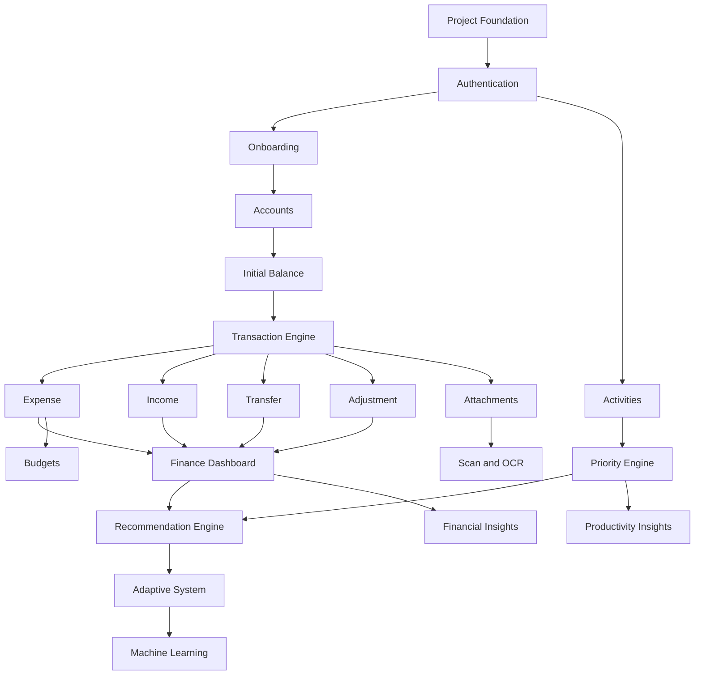

# Feature Priority and Development Phases — Laras

## 1. Informasi Dokumen

- **Nama proyek:** Laras
- **Tagline:** Selaraskan hari, tentukan langkah.
- **Jenis dokumen:** Feature Priority and Development Phases
- **Versi:** 1.0
- **Tanggal:** 31 Juli 2026
- **Dokumen terkait:**
  - `01-project-scope.md`
  - `02-user-flow.md`
  - `03-sitemap-and-page-list.md`

---

## 2. Tujuan Dokumen

Dokumen ini digunakan untuk:

- Menentukan prioritas setiap fitur.
- Membagi pengembangan Laras menjadi fase yang lebih kecil.
- Menentukan dependensi antarfitur.
- Mencegah ruang lingkup berkembang terlalu cepat.
- Menentukan hasil akhir setiap fase.
- Menentukan kriteria selesai atau Definition of Done.
- Menjadi dasar penyusunan backlog, milestone, dan commit Git.
- Memastikan fitur keuangan dan saldo dikembangkan dengan aman.

---

# 3. Prinsip Prioritas Pengembangan

Prioritas ditentukan berdasarkan:

1. Dampak fitur terhadap fungsi utama aplikasi.
2. Ketergantungan fitur lain terhadap fitur tersebut.
3. Risiko kesalahan data.
4. Frekuensi penggunaan.
5. Tingkat kesulitan implementasi.
6. Nilai fitur bagi penggunaan sehari-hari.
7. Kesiapan data untuk sistem adaptif.
8. Kebutuhan testing.

Urutan pengembangan tidak hanya mengikuti tampilan halaman. Fitur dengan dependensi besar harus diselesaikan lebih dahulu.

---

# 4. Tingkat Prioritas

## P0 — Fondasi Kritis

Fitur yang harus tersedia agar aplikasi dapat berjalan dengan aman.

Contoh:

- Autentikasi.
- Database.
- Account management.
- Saldo awal.
- Transaction engine.
- Audit log.
- Validasi.
- Database transaction.

## P1 — Fitur Utama MVP

Fitur yang memberikan nilai utama Laras.

Contoh:

- Pengeluaran.
- Pemasukan.
- Transfer.
- Kegiatan.
- Priority engine.
- Dashboard.
- Recommendation engine.

## P2 — Fitur Pendukung Penting

Fitur yang memperkuat pengalaman dan insight.

Contoh:

- Anggaran.
- Insight.
- Notes.
- Notifications.
- Search.
- Lampiran.

## P3 — Fitur Lanjutan

Fitur yang dikerjakan setelah MVP stabil.

Contoh:

- OCR.
- Scan otomatis.
- Sistem adaptif.
- Machine learning.
- PWA penuh.
- Backup cloud.

---

# 5. Aturan Scope Control

Setiap fitur baru harus melalui pemeriksaan berikut:

```text
Apakah fitur ini dibutuhkan untuk menyelesaikan fase aktif?
Apakah fitur ini memiliki dependensi yang sudah tersedia?
Apakah fitur ini memengaruhi data keuangan?
Apakah fitur ini sudah ada di project scope?
Apakah fitur ini dapat ditunda?
```

Jika jawabannya tidak mendukung fase aktif, fitur dimasukkan ke backlog.

Tidak boleh menambahkan fitur baru ke fase aktif tanpa memperbarui:

- Project scope.
- Sitemap.
- Database design.
- Development phases.
- Testing plan.

---

# 6. Gambaran Fase Pengembangan

```text
Fase 0  — Persiapan dan Dokumentasi
Fase 1  — Fondasi Proyek
Fase 2  — Autentikasi dan Onboarding
Fase 3  — Manajemen Rekening dan Saldo Awal
Fase 4  — Transaction Engine
Fase 5  — Modul Keuangan Inti
Fase 6  — Dashboard Keuangan
Fase 7  — Modul Kegiatan
Fase 8  — Priority Engine
Fase 9  — Recommendation Engine
Fase 10 — Insight dan Anggaran
Fase 11 — Lampiran dan Dokumen
Fase 12 — UI, Animasi, dan Responsiveness
Fase 13 — Testing dan Hardening
Fase 14 — Deployment MVP
Fase 15 — Scan dan OCR
Fase 16 — Sistem Adaptif
Fase 17 — Machine Learning
```

---

# 7. Fase 0 — Persiapan dan Dokumentasi

## Tujuan

Menyelesaikan keputusan dasar sebelum coding.

## Prioritas

P0.

## Ruang Lingkup

- Menentukan nama proyek.
- Membuat project scope.
- Membuat user flow.
- Membuat sitemap.
- Membuat fase pengembangan.
- Menentukan MVP.
- Menentukan teknologi.
- Menyiapkan referensi desain.
- Menentukan aturan penamaan.
- Menentukan struktur dokumentasi.

## Output

```text
docs/
├── 01-project-scope.md
├── 02-user-flow.md
├── 03-sitemap-and-page-list.md
└── 04-feature-priority-and-development-phases.md
```

## Definition of Done

- Nama proyek Laras ditetapkan.
- MVP inti dan fitur lanjutan dipisahkan.
- Alur utama sudah terdokumentasi.
- Daftar halaman sudah tersedia.
- Route awal sudah dirancang.
- Tahapan pengembangan disepakati.
- Tidak ada coding sebelum dokumen dasar tersedia.

## Status

Sedang berjalan.

---

# 8. Fase 1 — Fondasi Proyek

## Tujuan

Membuat fondasi teknis Laras yang bersih dan siap dikembangkan.

## Prioritas

P0.

## Dependensi

Fase 0 selesai.

## Ruang Lingkup

- Membuat project Laravel.
- Mengatur `.env`.
- Menghubungkan MySQL.
- Mengatur timezone `Asia/Jakarta`.
- Mengatur locale.
- Mengatur currency helper.
- Memasang Tailwind CSS.
- Memasang Alpine.js.
- Memasang Chart.js.
- Memasang Lucide Icons.
- Menyiapkan GSAP tetapi belum membuat animasi kompleks.
- Menyiapkan Git.
- Membuat repository GitHub.
- Membuat struktur folder.
- Membuat base layout.
- Menyiapkan error handling.
- Menyiapkan logging.
- Menyiapkan code formatting.

## Struktur Awal yang Disarankan

```text
app/
├── Enums/
├── Helpers/
├── Http/
│   ├── Controllers/
│   ├── Middleware/
│   └── Requests/
├── Models/
├── Services/
├── Actions/
├── Policies/
└── Support/

resources/
├── css/
├── js/
└── views/
    ├── components/
    ├── layouts/
    ├── auth/
    ├── onboarding/
    ├── dashboard/
    ├── activities/
    ├── finance/
    ├── recommendations/
    ├── insights/
    ├── notes/
    ├── settings/
    └── errors/
```

## Output

- Laravel dapat dijalankan.
- Database terhubung.
- Asset frontend ter-compile.
- Base layout tampil.
- Repository Git aktif.
- README diperbarui.
- Commit fondasi dibuat.

## Testing Minimum

- Aplikasi dapat dibuka.
- Database connection berhasil.
- Asset CSS dan JS tampil.
- Error page dasar dapat dirender.
- Timezone benar.

## Definition of Done

- Tidak ada error saat menjalankan Laravel.
- `php artisan test` dapat dijalankan.
- `npm run build` berhasil.
- Struktur proyek konsisten.
- `.env` tidak masuk repository.
- `.env.example` diperbarui.
- Commit fase dibuat.

## Commit yang Disarankan

```text
chore: initialize Laras application foundation
```

---

# 9. Fase 2 — Autentikasi dan Onboarding

## Tujuan

Membuat akses pribadi dan setup awal pengguna.

## Prioritas

P0.

## Dependensi

Fase 1 selesai.

## Ruang Lingkup

### Autentikasi

- Login.
- Logout.
- Remember me.
- Middleware auth.
- Single-user policy.
- Password hashing.
- Login validation.
- Rate limiting.
- Session handling.

### Onboarding

- Welcome.
- Profile setup.
- Timezone.
- Currency.
- Date format.
- Account selection.
- Initial balance setup.
- Setup review.
- Onboarding complete flag.

## Data yang Dibutuhkan

- User.
- User preference.
- Onboarding status.
- Default accounts seed.

## Output

- Pengguna dapat login.
- Pengguna pertama kali diarahkan ke onboarding.
- Pengguna yang sudah menyelesaikan onboarding diarahkan ke dashboard.
- Data setup awal tersimpan.

## Testing Minimum

- Login valid.
- Login gagal.
- Logout.
- Remember me.
- Redirect onboarding.
- Redirect dashboard.
- Unauthorized access.
- Validasi form onboarding.
- Onboarding tidak dapat dilewati secara tidak aman.

## Definition of Done

- Seluruh route privat dilindungi.
- Tidak tersedia registrasi publik.
- Onboarding tersimpan secara bertahap.
- Refresh tidak menghapus progres.
- Akun awal dapat dipilih.
- Setup selesai menghasilkan redirect ke dashboard.

## Commit yang Disarankan

```text
feat: add authentication and onboarding flow
```

---

# 10. Fase 3 — Manajemen Rekening dan Saldo Awal

## Tujuan

Membuat sumber dana dan titik awal pencatatan keuangan.

## Prioritas

P0.

## Dependensi

Fase 2 selesai.

## Ruang Lingkup

- Account model.
- Account type.
- BCA.
- Mandiri.
- BNI Pribadi.
- BNI Mahasiswa.
- SeaBank.
- Cash.
- Custom account.
- Saldo awal.
- Tanggal saldo awal.
- Nomor akun tersamarkan.
- Ikon dan warna.
- Batas saldo minimum.
- Status aktif.
- Include in total balance.
- Account list.
- Account detail.
- Edit account.
- Activate/deactivate.
- Account audit log.

## Aturan Penting

- Akun dengan transaksi tidak boleh hard delete.
- Saldo awal bukan pemasukan.
- Saldo tidak diedit langsung.
- Nominal menggunakan decimal.
- Tanggal saldo awal wajib.
- Nomor rekening ditampilkan tersamarkan.

## Output

- Pengguna dapat mengelola semua akun.
- Saldo awal setiap akun tersimpan.
- Total saldo awal dapat dihitung.
- Account detail tersedia.
- Akun dapat dinonaktifkan.

## Testing Minimum

- Create account.
- Edit account.
- Deactivate account.
- Reactivate account.
- Zero initial balance.
- Positive initial balance.
- Invalid amount.
- Date validation.
- Masking account number.
- Total balance calculation.

## Definition of Done

- Saldo awal tidak masuk income report.
- Total saldo sesuai jumlah akun aktif yang disertakan.
- Akun nonaktif tidak muncul di form transaksi baru.
- Riwayat akun tetap tersedia.
- Audit log perubahan akun tersimpan.

## Commit yang Disarankan

```text
feat: add account and initial balance management
```

---

# 11. Fase 4 — Transaction Engine

## Tujuan

Membuat mesin transaksi yang menjadi fondasi seluruh modul keuangan.

## Prioritas

P0.

## Dependensi

Fase 3 selesai.

## Ruang Lingkup

- Transaction model.
- Transaction type.
- Transaction status.
- Source account.
- Destination account.
- Main amount.
- Admin fee.
- Tax.
- Discount.
- Cashback.
- Total calculation.
- Balance before.
- Balance after.
- Database transaction.
- Soft delete.
- Audit trail.
- Transaction service.
- Balance service.
- Recalculation service.
- Status rules.
- Validation rules.

## Service yang Disarankan

```text
TransactionService
BalanceService
TransferService
TransactionCalculationService
TransactionAuditService
```

## Aturan Penting

- Saldo hanya berubah untuk transaksi final.
- Transaksi draft tidak mengubah saldo.
- Transaksi pending tidak mengubah saldo final.
- Transaksi failed tidak mengubah saldo.
- Edit transaksi menghitung ulang saldo.
- Delete transaksi menghitung ulang saldo.
- Seluruh perubahan saldo memiliki jejak.
- Uang tidak boleh menggunakan float.

## Output

- Mesin transaksi siap digunakan oleh expense, income, transfer, refund, fee, dan adjustment.
- Perhitungan nominal konsisten.
- Saldo dapat dihitung ulang.

## Testing Minimum

- Total expense calculation.
- Income calculation.
- Fee and tax.
- Discount and cashback.
- Status behavior.
- Soft delete.
- Restore optional.
- Balance before and after.
- Transaction rollback ketika error.
- Decimal precision.

## Definition of Done

- Tidak ada perubahan saldo tanpa transaksi.
- Database rollback bekerja jika proses gagal.
- Nominal akhir konsisten.
- Audit trail tersedia.
- Unit test transaksi lulus.
- Feature test transaksi dasar lulus.

## Commit yang Disarankan

```text
feat: implement financial transaction engine
```

---

# 12. Fase 5 — Modul Keuangan Inti

## Tujuan

Menyelesaikan alur keuangan utama yang digunakan setiap hari.

## Prioritas

P1.

## Dependensi

Fase 4 selesai.

## Ruang Lingkup

### Expense

- Create expense.
- Edit expense.
- Delete/archive expense.
- Source account.
- Merchant.
- Purpose.
- Category.
- Necessity level.
- Admin.
- Tax.
- Discount.
- Cashback.
- Payment method.
- Reference.
- Notes.

### Income

- Create income.
- Edit income.
- Destination account.
- Sender.
- Source.
- Category.
- Reference.

### Transfer

- Source.
- Destination.
- Amount.
- Admin fee.
- Linked transaction record.
- Transfer detail.

### Balance Adjustment

- Current balance.
- Actual balance.
- Difference.
- Reason.
- Audit.

### Transaction History

- List.
- Filter.
- Search.
- Detail.
- Edit.
- Archive.
- Balance impact preview.

## Output

- Pengeluaran dapat dicatat.
- Pemasukan dapat dicatat.
- Transfer antar-akun bekerja.
- Penyesuaian saldo bekerja.
- Riwayat transaksi tersedia.
- Saldo setiap akun berubah dengan benar.

## Testing Minimum

- Expense success.
- Expense insufficient balance.
- Income success.
- Transfer success.
- Transfer same account.
- Transfer insufficient balance.
- Transfer with admin.
- Adjustment positive.
- Adjustment negative.
- Edit transaction.
- Delete transaction.
- Filter transaction.
- Search merchant.
- Running balance.

## Definition of Done

- Semua alur keuangan utama berjalan tanpa error.
- Transfer internal tidak masuk income dan expense utama.
- Biaya admin transfer masuk expense.
- Saldo total hanya berubah sebesar biaya transfer.
- Edit dan delete menghitung ulang saldo.
- Riwayat saldo sesuai transaksi.

## Commit yang Disarankan

```text
feat: add core income expense and transfer flows
```

---

# 13. Fase 6 — Dashboard Keuangan

## Tujuan

Menampilkan kondisi keuangan secara ringkas dan mudah dipahami.

## Prioritas

P1.

## Dependensi

Fase 5 selesai.

## Ruang Lingkup

- Total balance.
- Balance per account.
- Income this month.
- Expense this month.
- Net flow.
- Recent transactions.
- Low balance alerts.
- Admin fee total.
- Tax total.
- Expense by category.
- Expense by account.
- Quick financial actions.
- Hide balance toggle.
- Basic Chart.js charts.

## Output

- Dashboard keuangan memiliki data nyata.
- Ringkasan saldo tampil.
- Pengguna dapat menuju transaksi dari dashboard.

## Testing Minimum

- Empty data.
- One account.
- Multiple accounts.
- Hidden balance.
- Monthly calculation.
- Category calculation.
- Chart data.
- Low balance threshold.

## Definition of Done

- Data dashboard sama dengan data transaksi.
- Tidak ada double counting transfer.
- Grafik tidak error jika data kosong.
- Tampilan mobile dan desktop berfungsi.
- Loading dan empty state tersedia.

## Commit yang Disarankan

```text
feat: add financial dashboard and account summaries
```

---

# 14. Fase 7 — Modul Kegiatan

## Tujuan

Membuat manajemen kegiatan sehari-hari.

## Prioritas

P1.

## Dependensi

Fase 1 dan autentikasi selesai.

Fase ini dapat dimulai setelah keuangan inti stabil.

## Ruang Lingkup

- Create activity.
- Edit activity.
- Delete/archive.
- Category.
- Description.
- Importance.
- Impact.
- Estimated duration.
- Actual duration.
- Start date.
- Deadline.
- Status.
- Start activity.
- Complete activity.
- Postpone.
- Reschedule.
- Cancel.
- Activity history.
- Activity list.
- Filter and search.

## Output

- Pengguna dapat mengelola kegiatan.
- Status kegiatan tercatat.
- Jumlah penundaan tersimpan.
- Durasi aktual dapat dicatat.

## Testing Minimum

- Create activity.
- Invalid deadline.
- Start.
- Complete.
- Postpone.
- Reschedule.
- Cancel.
- Edit.
- Archive.
- Filter.
- Overdue condition.

## Definition of Done

- Semua status memiliki transisi yang valid.
- Riwayat status tersimpan.
- Kegiatan selesai tidak muncul sebagai aktif.
- Kegiatan terlambat terdeteksi.
- Data siap digunakan priority engine.

## Commit yang Disarankan

```text
feat: add activity management workflow
```

---

# 15. Fase 8 — Priority Engine

## Tujuan

Menghitung prioritas kegiatan secara otomatis dan dapat dijelaskan.

## Prioritas

P1.

## Dependensi

Fase 7 selesai.

## Ruang Lingkup

- Priority score.
- Priority level.
- Rule configuration.
- Deadline scoring.
- Importance scoring.
- Impact scoring.
- Postponement scoring.
- Duration scoring.
- Status scoring.
- Priority reason.
- Automatic recalculation.
- Scheduled recalculation.
- Priority badges.
- Sort by priority.

## Service yang Disarankan

```text
PriorityService
PriorityRuleService
PriorityExplanationService
```

## Output

- Setiap kegiatan memiliki skor.
- Skor dapat dihitung ulang.
- Alasan prioritas tampil.
- Kegiatan dapat diurutkan otomatis.

## Testing Minimum

- Critical deadline.
- No deadline.
- High importance.
- Multiple postponements.
- Completed activity.
- Cancelled activity.
- Score boundary.
- Reason generation.
- Scheduled recalculation.

## Definition of Done

- Skor konsisten.
- Level sesuai rentang.
- Alasan tidak kosong.
- Perubahan deadline memperbarui skor.
- Perubahan status memperbarui skor.
- Priority engine memiliki unit test.

## Commit yang Disarankan

```text
feat: implement explainable activity priority engine
```

---

# 16. Fase 9 — Recommendation Engine

## Tujuan

Memberikan saran berbasis aturan dari kegiatan dan keuangan.

## Prioritas

P1.

## Dependensi

- Fase 6 selesai.
- Fase 8 selesai.

## Ruang Lingkup

### Activity Recommendations

- Deadline dekat.
- Aktivitas tertunda.
- Aktivitas berdampak tinggi.
- Aktivitas dapat diselesaikan cepat.
- Suggested next action.

### Financial Recommendations

- Low balance.
- Budget warning.
- Excessive admin fee.
- Increased spending.
- Account misuse warning.
- Missing receipt.
- Unreviewed draft scan future-ready.

### Feedback

- Follow.
- Schedule.
- Postpone.
- Ignore.
- Not relevant.

### Recommendation Control

- Avoid duplicates.
- Expiration.
- Priority.
- Confidence.
- Supporting data.
- Explanation.

## Output

- Rekomendasi aktif tampil.
- Alasan tersedia.
- Feedback tersimpan.
- Rekomendasi dapat ditindaklanjuti.

## Testing Minimum

- Rule triggered.
- Rule not triggered.
- Duplicate prevention.
- Expired recommendation.
- Feedback.
- Related activity.
- Related account.
- Reason text.
- Confidence range.

## Definition of Done

- Tidak ada rekomendasi tanpa alasan.
- Feedback tersimpan.
- Rekomendasi tidak berulang secara berlebihan.
- Data pendukung dapat ditelusuri.
- Recommendation engine memiliki unit test.

## Commit yang Disarankan

```text
feat: add rule-based recommendation engine
```

---

# 17. Fase 10 — Insight dan Anggaran

## Tujuan

Memberikan evaluasi sederhana dari data yang sudah terkumpul.

## Prioritas

P2.

## Dependensi

- Modul keuangan stabil.
- Modul kegiatan stabil.
- Recommendation engine tersedia.

## Ruang Lingkup

### Budget

- Create budget.
- Period.
- Category.
- Warning threshold.
- Usage.
- Remaining amount.
- Status.

### Financial Insight

- Expense by category.
- Expense by account.
- Expense by merchant.
- Admin fee.
- Tax.
- Discount.
- Cashback.
- Period comparison.

### Productivity Insight

- Completion rate.
- Postponement rate.
- Productive day.
- Productive time.
- Estimate vs actual.
- Category performance.

### Weekly Review

- Weekly summary.
- Main achievement.
- Main delay.
- Budget result.
- Suggested focus.

## Output

- Anggaran dapat dipantau.
- Insight dapat difilter berdasarkan periode.
- Empty state tersedia jika data belum cukup.

## Testing Minimum

- Budget calculation.
- Threshold warning.
- Period calculation.
- No data.
- Multiple categories.
- Weekly boundary.
- Timezone handling.

## Definition of Done

- Insight berdasarkan data nyata.
- Transfer internal tidak mengganggu laporan.
- Grafik aman saat data kosong.
- Anggaran memperbarui setelah expense.
- Weekly review menggunakan periode yang benar.

## Commit yang Disarankan

```text
feat: add budgets and personal insights
```

---

# 18. Fase 11 — Lampiran dan Dokumen

## Tujuan

Menyimpan bukti transaksi secara aman.

## Prioritas

P2.

## Dependensi

Fase 5 selesai.

## Ruang Lingkup

- Upload attachment.
- Private storage.
- Validation.
- Image preview.
- Multiple attachments.
- Delete attachment.
- Replace attachment.
- File metadata.
- Secure download route.
- Masking sensitive content where applicable.
- Attachment indicator.

## Output

- Bukti transaksi dapat diunggah.
- File tidak dapat diakses publik secara langsung.
- Preview tersedia.

## Testing Minimum

- Valid image.
- Invalid file.
- Oversized file.
- Unauthorized file access.
- Delete file.
- Multiple files.
- Broken file.
- Secure download.

## Definition of Done

- Tidak ada file sensitif di public folder.
- Validasi MIME type berjalan.
- File hanya dapat diakses pengguna terautentikasi.
- Hapus lampiran tidak menghapus transaksi.
- Storage cleanup tersedia.

## Commit yang Disarankan

```text
feat: add secure transaction attachments
```

---

# 19. Fase 12 — UI, Animasi, dan Responsiveness

## Tujuan

Menyempurnakan pengalaman visual Laras tanpa mengganggu fungsi.

## Prioritas

P2.

## Dependensi

Fitur utama MVP stabil.

## Ruang Lingkup

- Design system.
- Color tokens.
- Typography.
- Buttons.
- Inputs.
- Cards.
- Status badges.
- Priority badges.
- Navigation.
- Responsive layout.
- Mobile bottom navigation.
- Desktop sidebar.
- Dark mode.
- Opening animation.
- Page transition.
- Micro-interactions.
- Loading skeleton.
- Empty state.
- Error state.
- Reduced motion.
- Keyboard focus.

## Aturan Animasi

- Animasi harus memiliki fungsi.
- Durasi singkat.
- Tidak menghambat navigasi.
- Opening animation dapat dilewati.
- Reduced-motion wajib didukung.
- Tidak menggunakan glow dan gradient berlebihan.

## Output

- UI konsisten.
- Mobile dan desktop nyaman digunakan.
- Animasi pembuka tersedia.
- Dark mode tersedia.

## Testing Minimum

Ukuran layar:

```text
360px
390px
768px
1024px
1280px
1440px
```

Testing:

- Keyboard.
- Focus state.
- Contrast.
- Dark mode.
- Reduced motion.
- Long text.
- Empty data.
- Large nominal.
- Mobile form.

## Definition of Done

- Tidak ada horizontal overflow.
- Semua form dapat digunakan pada mobile.
- Bottom navigation tidak menutupi konten.
- Sidebar bekerja.
- Animasi tidak menyebabkan layout shift.
- Lighthouse accessibility berada pada tingkat baik.
- Design tidak terlihat generik.

## Commit yang Disarankan

```text
feat: refine Laras interface and responsive experience
```

---

# 20. Fase 13 — Testing dan Hardening

## Tujuan

Memastikan MVP aman, akurat, dan stabil.

## Prioritas

P0 sebelum deployment.

## Dependensi

Seluruh fitur MVP inti selesai.

## Ruang Lingkup

### Unit Test

- Balance calculation.
- Transaction calculation.
- Transfer calculation.
- Priority engine.
- Recommendation rules.
- Budget calculation.

### Feature Test

- Login.
- Onboarding.
- Account.
- Expense.
- Income.
- Transfer.
- Adjustment.
- Activity.
- Recommendation.
- Attachment.

### Manual Test

- Mobile.
- Desktop.
- Dark mode.
- Error states.
- Upload.
- Long sessions.
- Large data.

### Security

- CSRF.
- Auth.
- Authorization.
- File access.
- Mass assignment.
- Validation.
- Rate limiting.
- Sensitive logs.

### Data Integrity

- Decimal.
- Transaction rollback.
- Soft delete.
- Recalculation.
- Audit log.
- Backup.

## Output

- Test suite.
- Bug list.
- Security checklist.
- Regression checklist.
- Release candidate.

## Definition of Done

- Seluruh test kritis lulus.
- Tidak ada bug saldo.
- Tidak ada file sensitif terbuka.
- Tidak ada route privat tanpa auth.
- Tidak ada error utama pada mobile.
- Backup manual berhasil.
- Data dapat dipulihkan pada pengujian.

## Commit yang Disarankan

```text
test: harden Laras MVP and financial workflows
```

---

# 21. Fase 14 — Deployment MVP

## Tujuan

Menyediakan Laras untuk penggunaan pribadi secara nyata.

## Prioritas

P1.

## Dependensi

Fase 13 selesai.

## Ruang Lingkup

- Production environment.
- Environment variables.
- Database migration.
- Storage link or private storage configuration.
- HTTPS.
- Scheduler.
- Queue if used.
- Backup.
- Error monitoring.
- Log rotation.
- Production build.
- Single-user seeding.
- Data migration from test to production if needed.

## Output

- Laras dapat diakses.
- HTTPS aktif.
- Database production tersedia.
- Backup berjalan.
- User dapat login.

## Definition of Done

- Tidak menggunakan debug mode.
- Secret tidak masuk repository.
- HTTPS aktif.
- Backup diuji.
- Scheduler berjalan.
- Upload file bekerja.
- Test smoke production lulus.
- Versi MVP diberi tag.

## Tag yang Disarankan

```text
v1.0.0-mvp
```

---

# 22. Fase 15 — Scan dan OCR

## Tujuan

Membantu input transaksi dari struk dan bukti pembayaran.

## Prioritas

P3.

## Dependensi

- Transaksi manual stabil.
- Lampiran stabil.
- Draft transaction tersedia.

## Ruang Lingkup

- Upload scan.
- Image preprocessing.
- OCR.
- Extracted fields.
- Confidence score.
- Review page.
- Draft transaction.
- Confirm.
- Reject.
- Retry.
- Original OCR text.
- Duplicate warning sederhana.

## Arsitektur Awal

Pilihan:

```text
Laravel
→ OCR service
→ Hasil ekstraksi
→ Draft transaction
→ Review
→ Confirm
```

OCR dapat menggunakan:

- Tesseract lokal.
- Python + OpenCV.
- FastAPI.
- OCR API eksternal.

## Output

- Struk dapat diproses.
- Form terisi otomatis.
- Confidence ditampilkan.
- Transaksi tidak langsung final.

## Testing Minimum

- Clear receipt.
- Blurry receipt.
- Screenshot transfer.
- Screenshot e-wallet.
- Different date format.
- Different currency formatting.
- Missing tax.
- Duplicate image.
- OCR failure.

## Definition of Done

- Semua scan menghasilkan draft atau error yang jelas.
- Saldo tidak berubah sebelum konfirmasi.
- Field rendah confidence ditandai.
- Original file dan hasil OCR dapat ditelusuri.
- Pengguna dapat mengoreksi seluruh field.

## Commit yang Disarankan

```text
feat: add receipt and payment proof scanning
```

---

# 23. Fase 16 — Sistem Adaptif

## Tujuan

Menyesuaikan saran berdasarkan pola penggunaan nyata.

## Prioritas

P3.

## Dependensi

Data penggunaan sudah cukup.

## Ruang Lingkup

- Feedback analysis.
- User pattern profile.
- Productive time.
- Postponement pattern.
- Merchant frequency.
- Account usage.
- Recommendation effectiveness.
- Weight adjustment.
- Personalized thresholds.
- Explainable adaptation.

## Aturan

- Penyesuaian harus transparan.
- Pengguna dapat mereset preferensi adaptif.
- Sistem tidak mengambil keputusan final.
- Rekomendasi tetap memiliki alasan.
- Perubahan bobot dicatat.

## Output

- Rekomendasi lebih personal.
- Sistem belajar dari feedback.
- Bobot dapat berubah secara terbatas.

## Definition of Done

- Perubahan rekomendasi dapat dijelaskan.
- Tidak ada perubahan ekstrem.
- Pengguna dapat menolak dan mereset.
- Data feedback digunakan dengan benar.

---

# 24. Fase 17 — Machine Learning

## Tujuan

Mengembangkan prediksi dari data penggunaan yang sudah matang.

## Prioritas

P3.

## Dependensi

- Sistem adaptif stabil.
- Dataset cukup.
- Data bersih.
- Target prediksi jelas.

## Kandidat Prediksi

- Kemungkinan kegiatan selesai tepat waktu.
- Risiko kegiatan ditunda.
- Waktu produktif.
- Risiko anggaran terlampaui.
- Pengeluaran tidak biasa.
- Rekomendasi aktivitas berikutnya.

## Arsitektur

```text
Laravel
→ FastAPI
→ Model
→ Prediction
→ Recommendation Service
→ User Interface
```

## Aturan

- Model bukan pengambil keputusan final.
- Prediksi memiliki confidence.
- Fallback rule-based tetap tersedia.
- Data sensitif tidak dikirim sembarangan.
- Evaluasi model wajib dilakukan.
- Model harus dapat dinonaktifkan.

## Definition of Done

- Model lebih baik dari baseline.
- Prediksi dapat dijelaskan secara memadai.
- Fallback bekerja.
- Tidak mengganggu transaction engine.
- Monitoring akurasi tersedia.

---

# 25. Matriks Prioritas Fitur

| Fitur | Prioritas | Fase | Dependensi |
|---|---|---:|---|
| Setup Laravel | P0 | 1 | Dokumentasi |
| Login | P0 | 2 | Fondasi |
| Onboarding | P0 | 2 | Login |
| Accounts | P0 | 3 | Onboarding |
| Initial Balance | P0 | 3 | Accounts |
| Transaction Engine | P0 | 4 | Accounts |
| Expense | P1 | 5 | Transaction Engine |
| Income | P1 | 5 | Transaction Engine |
| Transfer | P1 | 5 | Transaction Engine |
| Adjustment | P1 | 5 | Transaction Engine |
| Transaction History | P1 | 5 | Transactions |
| Financial Dashboard | P1 | 6 | Finance Core |
| Activities | P1 | 7 | Auth |
| Priority Engine | P1 | 8 | Activities |
| Recommendations | P1 | 9 | Finance + Priority |
| Budgets | P2 | 10 | Expense |
| Insights | P2 | 10 | Historical Data |
| Attachments | P2 | 11 | Transactions |
| Responsive UI | P2 | 12 | Main Features |
| Dark Mode | P2 | 12 | Design System |
| Opening Animation | P2 | 12 | App Layout |
| Testing | P0 | 13 | MVP Features |
| Deployment | P1 | 14 | Testing |
| OCR | P3 | 15 | Attachments + Draft |
| Adaptive System | P3 | 16 | Feedback Data |
| Machine Learning | P3 | 17 | Sufficient Dataset |

---

# 26. Dependensi Fitur



---

# 27. Definition of Done Global

Sebuah fitur dianggap selesai apabila:

- Requirement terpenuhi.
- Validasi tersedia.
- Authorization tersedia jika diperlukan.
- UI memiliki loading state.
- UI memiliki empty state.
- UI memiliki error state.
- Mobile dan desktop telah diuji.
- Data sensitif terlindungi.
- Unit atau feature test tersedia untuk logika penting.
- Tidak ada error pada lint dan build.
- Dokumentasi diperbarui.
- Commit dibuat.
- Tidak meninggalkan kode debug.
- Tidak merusak fitur sebelumnya.

---

# 28. Checklist Kualitas Setiap Fase

## Backend

- Controller tidak terlalu besar.
- Logika bisnis berada pada service/action.
- Form Request digunakan.
- Enum digunakan untuk status.
- Database transaction digunakan untuk keuangan.
- Query diperiksa.
- N+1 query dihindari.
- Soft delete digunakan pada data penting.
- Audit log tersedia.

## Frontend

- Komponen reusable.
- Form accessible.
- Error dekat field.
- Loading state.
- Prevent double submit.
- Responsive.
- Dark mode.
- Reduced motion.
- No horizontal overflow.

## Database

- Foreign key.
- Index.
- Decimal money.
- Timestamp.
- Soft delete.
- Constraint.
- Unique rules.
- Consistent naming.

## Security

- Auth.
- CSRF.
- Validation.
- Authorization.
- Private files.
- Masked account.
- Safe logs.
- Rate limiting.

## Testing

- Happy path.
- Invalid input.
- Boundary value.
- Empty state.
- Failure state.
- Data consistency.
- Regression.

---

# 29. Strategi Commit

Setiap fase sebaiknya memiliki beberapa commit kecil.

Contoh:

```text
feat: add account database schema
feat: add account management service
feat: add account onboarding interface
test: cover account balance behavior
docs: update account development notes
```

Hindari satu commit besar yang mencakup seluruh fase.

Format commit:

```text
type: description
```

Tipe:

- `feat`
- `fix`
- `test`
- `docs`
- `refactor`
- `chore`
- `style`
- `perf`

---

# 30. Strategi Branch

Untuk proyek pribadi, strategi sederhana:

```text
main
└── feature/<nama-fitur>
```

Contoh:

```text
feature/authentication
feature/account-management
feature/transaction-engine
feature/activity-priority
```

Aturan:

- `main` selalu stabil.
- Fitur dikerjakan pada branch.
- Jalankan test sebelum merge.
- Gunakan pull request meskipun proyek pribadi untuk dokumentasi.
- Tag versi pada milestone.

---

# 31. Milestone GitHub yang Disarankan

## Milestone 1 — Foundation

- Fase 1.
- Fase 2.
- Fase 3.

## Milestone 2 — Finance Core

- Fase 4.
- Fase 5.
- Fase 6.

## Milestone 3 — Personal Productivity

- Fase 7.
- Fase 8.
- Fase 9.

## Milestone 4 — MVP Complete

- Fase 10.
- Fase 11.
- Fase 12.
- Fase 13.

## Milestone 5 — Release

- Fase 14.

## Milestone 6 — Smart Input

- Fase 15.

## Milestone 7 — Adaptive Intelligence

- Fase 16.
- Fase 17.

---

# 32. Batasan Fase Aktif

Ketika suatu fase sedang dikerjakan:

- Jangan mengerjakan fitur fase lain kecuali menjadi blocker.
- Jangan menambahkan animasi sebelum fungsi stabil.
- Jangan menambahkan OCR sebelum transaction engine selesai.
- Jangan menambahkan machine learning sebelum data tersedia.
- Jangan mengubah database tanpa migration.
- Jangan menambahkan package tanpa alasan.
- Jangan mengabaikan test pada fitur keuangan.
- Jangan mencampur refactor besar dengan fitur baru.

---

# 33. Risiko Utama dan Mitigasi

## 33.1 Scope Terlalu Besar

Mitigasi:

- Mengikuti fase.
- Menahan fitur P3.
- Menggunakan backlog.
- Melakukan review akhir fase.

## 33.2 Perhitungan Saldo Salah

Mitigasi:

- Transaction service.
- Database transaction.
- Unit test.
- Audit log.
- Recalculation.
- Decimal.

## 33.3 UI Dikerjakan Terlalu Awal

Mitigasi:

- Gunakan UI dasar dahulu.
- Animasi di fase 12.
- Fokus pada fungsi.

## 33.4 OCR Menjadi Hambatan

Mitigasi:

- OCR dipisah.
- Manual input tetap menjadi alur utama.
- Scan hanya menghasilkan draft.

## 33.5 Rekomendasi Tidak Relevan

Mitigasi:

- Mulai dengan aturan sederhana.
- Tampilkan alasan.
- Simpan feedback.
- Hindari terlalu banyak saran.

## 33.6 Data Hilang

Mitigasi:

- Backup.
- Soft delete.
- Audit trail.
- Export.
- Test restore.

---

# 34. Kriteria MVP Siap Digunakan

Laras siap digunakan secara pribadi apabila:

- Login aman.
- Onboarding selesai.
- Semua rekening dapat dimasukkan.
- Saldo awal tercatat.
- Pengeluaran dapat dicatat.
- Pemasukan dapat dicatat.
- Transfer bekerja.
- Penyesuaian saldo bekerja.
- Riwayat transaksi akurat.
- Dashboard keuangan benar.
- Kegiatan dapat dikelola.
- Prioritas dihitung.
- Rekomendasi tampil.
- Feedback tersimpan.
- Mobile dan desktop berfungsi.
- Dark mode berfungsi.
- Test kritis lulus.
- Backup tersedia.
- Deployment aman.

OCR tidak menjadi syarat MVP pertama.

---

# 35. Urutan Pengerjaan Praktis

Urutan praktis yang akan diikuti:

```text
1. Selesaikan dokumentasi.
2. Buat wireframe awal.
3. Buat database design dan ERD.
4. Setup Laravel.
5. Buat auth.
6. Buat onboarding.
7. Buat accounts.
8. Buat transaction engine.
9. Buat finance core.
10. Buat finance dashboard.
11. Buat activities.
12. Buat priority engine.
13. Buat recommendation engine.
14. Buat budgets dan insights.
15. Buat attachments.
16. Sempurnakan UI.
17. Testing.
18. Deploy MVP.
19. Tambahkan scan.
20. Tambahkan adaptive intelligence.
```

---

# 36. Tahap Berikutnya

Setelah dokumen ini disetujui, tahap berikutnya adalah membuat:

```text
docs/05-wireframe-specification.md
```

Dokumen wireframe akan menjelaskan:

- Struktur visual setiap halaman utama.
- Urutan komponen pada mobile dan desktop.
- Layout dashboard.
- Layout kegiatan.
- Layout keuangan.
- Layout rekening.
- Layout transaksi.
- Layout rekomendasi.
- Quick Add.
- Opening animation.
- Interaksi utama.
- State kosong, loading, dan error.

Setelah wireframe specification selesai, tahap berikutnya adalah desain database dan ERD sebelum setup Laravel.
