# ERD Specification — Laras

## 1. Informasi Dokumen

- **Nama proyek:** Laras
- **Tagline:** Selaraskan hari, tentukan langkah.
- **Jenis dokumen:** Entity Relationship Diagram Specification
- **Versi:** 1.0
- **Tanggal:** 31 Juli 2026
- **Database:** MySQL 8+
- **Framework:** Laravel
- **Dokumen terkait:**
  - `01-project-scope.md`
  - `02-user-flow.md`
  - `03-sitemap-and-page-list.md`
  - `04-feature-priority-and-development-phases.md`
  - `05-wireframe-specification.md`
  - `06-database-design.md`

---

## 2. Tujuan Dokumen

Dokumen ini menjelaskan hubungan antarentitas pada database Laras.

Spesifikasi ERD digunakan untuk:

- Memastikan seluruh tabel memiliki hubungan yang jelas.
- Menentukan cardinality.
- Menentukan primary key dan foreign key.
- Memisahkan domain keuangan, kegiatan, rekomendasi, dan sistem.
- Mencegah relasi ganda atau ambigu.
- Menjadi acuan pembuatan migration Laravel.
- Menjadi acuan relasi Eloquent.
- Menjadi acuan pembuatan diagram visual di dbdiagram.io, Draw.io, Lucidchart, atau Figma.

---

# 3. Notasi Cardinality

Notasi yang digunakan:

| Notasi | Arti |
|---|---|
| `1` | Tepat satu |
| `0..1` | Nol atau satu |
| `1..*` | Satu atau banyak |
| `0..*` | Nol atau banyak |

Dalam diagram Mermaid:

```text
||    = tepat satu
o|    = nol atau satu
|{    = satu atau banyak
o{    = nol atau banyak
```

Contoh:

```text
USER ||--o{ ACCOUNT : owns
```

Artinya:

- Satu user dapat memiliki nol atau banyak account.
- Setiap account harus dimiliki tepat satu user.

---

# 4. Pembagian Domain ERD

ERD Laras dibagi menjadi enam domain:

```text
1. Identity and Preferences
2. Categories
3. Finance
4. Activities
5. Recommendations and Insights
6. Supporting System
```

---

# 5. Diagram ERD Tingkat Tinggi

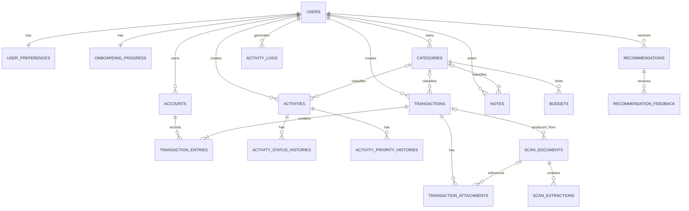

---

# 6. Domain Identity and Preferences

## 6.1 Entitas

- `users`
- `user_preferences`
- `onboarding_progress`
- `login_histories`

## 6.2 Diagram

```mermaid
erDiagram
    USERS {
        BIGINT id PK
        VARCHAR name
        VARCHAR email UK
        VARCHAR password
        TIMESTAMP onboarding_completed_at
        TIMESTAMP last_login_at
        BOOLEAN is_active
        TIMESTAMP deleted_at
    }

    USER_PREFERENCES {
        BIGINT id PK
        BIGINT user_id FK UK
        VARCHAR timezone
        VARCHAR locale
        CHAR currency
        VARCHAR appearance
        BOOLEAN reduced_motion
        BOOLEAN hide_balances
        BIGINT default_expense_account_id FK
        BIGINT default_income_account_id FK
    }

    ONBOARDING_PROGRESS {
        BIGINT id PK
        BIGINT user_id FK UK
        VARCHAR current_step
        BOOLEAN profile_completed
        BOOLEAN preferences_completed
        BOOLEAN accounts_completed
        BOOLEAN balances_completed
        BOOLEAN review_completed
        JSON draft_data
        TIMESTAMP completed_at
    }

    LOGIN_HISTORIES {
        BIGINT id PK
        BIGINT user_id FK
        VARCHAR email_attempted
        BOOLEAN was_successful
        VARCHAR ip_address
        TEXT user_agent
        VARCHAR failure_reason
        TIMESTAMP logged_in_at
    }

    USERS ||--|| USER_PREFERENCES : has
    USERS ||--|| ONBOARDING_PROGRESS : tracks
    USERS ||--o{ LOGIN_HISTORIES : has
```

## 6.3 Cardinality

### users — user_preferences

```text
users 1 : 1 user_preferences
```

- Setiap user memiliki satu preferensi.
- Setiap preferensi hanya dimiliki satu user.
- `user_preferences.user_id` unique.

### users — onboarding_progress

```text
users 1 : 1 onboarding_progress
```

- Setiap user memiliki satu progres onboarding.
- Record dibuat saat user pertama kali dibuat.

### users — login_histories

```text
users 1 : 0..* login_histories
```

- Login gagal dapat memiliki `user_id = NULL` jika email tidak cocok.
- Email yang dicoba tetap dapat dicatat.

---

# 7. Domain Categories

## 7.1 Entitas

- `categories`

Kategori digunakan oleh:

- Activities.
- Transactions.
- Notes.
- Budgets.

## 7.2 Diagram

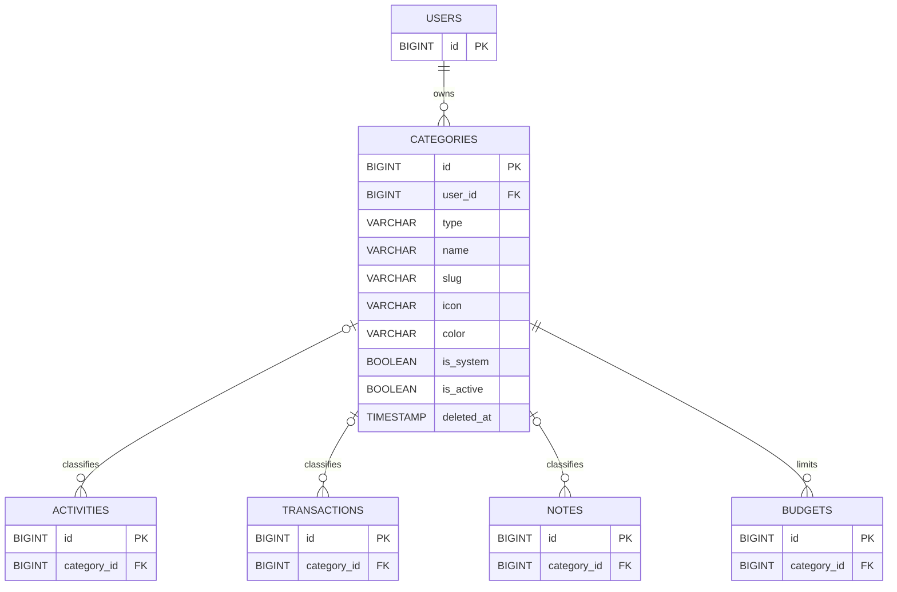

## 7.3 Aturan Relasi

- Category wajib dimiliki user.
- Category dapat tidak digunakan.
- Activity, transaction, dan note boleh tidak memiliki category.
- Budget wajib terhubung ke category bertipe `expense`.
- Category yang digunakan tidak dihapus permanen.
- Category dinonaktifkan untuk mencegah penggunaan baru.

---

# 8. Domain Finance

## 8.1 Entitas Utama

- `accounts`
- `transactions`
- `transaction_entries`
- `transaction_attachments`
- `account_balance_snapshots`
- `budgets`
- `budget_periods`
- `scan_documents`
- `scan_extractions`

---

## 8.2 Diagram Finance Core

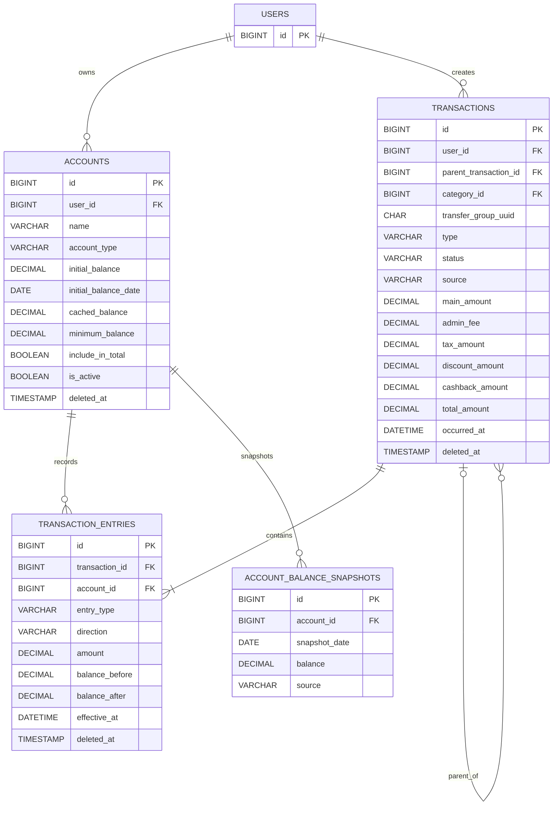

---

## 8.3 users — accounts

```text
users 1 : 0..* accounts
```

- Setiap account wajib dimiliki satu user.
- User dapat memiliki beberapa rekening, e-wallet, dan cash.
- Akun awal:
  - BCA.
  - Mandiri.
  - BNI Pribadi.
  - BNI Mahasiswa.
  - SeaBank.
  - Cash.

---

## 8.4 users — transactions

```text
users 1 : 0..* transactions
```

- Semua transaction dimiliki user.
- `user_id` tidak boleh null.

---

## 8.5 transactions — transaction_entries

```text
transactions 1 : 1..* transaction_entries
```

Untuk transaksi berstatus final, minimal terdapat satu ledger entry.

Pengecualian:

- Draft.
- Pending.
- Failed.
- Cancelled sebelum finalisasi.

Pengecualian tersebut belum memiliki entry aktif.

---

## 8.6 accounts — transaction_entries

```text
accounts 1 : 0..* transaction_entries
```

- Satu account dapat memiliki banyak entry.
- Satu entry hanya memengaruhi satu account.

---

## 8.7 transactions — parent transactions

Relasi self-reference:

```text
transactions 0..1 : 0..* child transactions
```

Digunakan untuk:

- Refund.
- Reversal.
- Correction.
- Related account fee.
- Cashback lanjutan.

Kolom:

```text
parent_transaction_id
```

---

# 9. Pola Ledger Transaksi

## 9.1 Expense

Contoh pengeluaran Rp50.000 dari BCA:

```text
transactions
└── type = expense
    total_amount = 50.000

transaction_entries
└── BCA
    direction = debit
    amount = 50.000
```

Cardinality:

```text
1 transaction : 1 account entry
```

Jika admin dan pajak dipisahkan:

```text
BCA debit principal
BCA debit admin_fee
BCA debit tax
```

Semua entry tetap berada di bawah satu transaction.

---

## 9.2 Income

Contoh pemasukan Rp500.000 ke BCA:

```text
transactions
└── type = income

transaction_entries
└── BCA
    direction = credit
    amount = 500.000
```

---

## 9.3 Internal Transfer

Contoh BCA ke SeaBank Rp500.000 dengan admin Rp2.500:

```text
transactions
└── type = internal_transfer
    transfer_group_uuid = UUID

transaction_entries
├── BCA
│   direction = debit
│   entry_type = transfer_principal
│   amount = 500.000
│
├── SeaBank
│   direction = credit
│   entry_type = transfer_principal
│   amount = 500.000
│
└── BCA
    direction = debit
    entry_type = admin_fee
    amount = 2.500
```

Cardinality:

```text
1 transfer transaction : 2..3 transaction entries
```

Transfer tanpa biaya:

```text
2 entries
```

Transfer dengan biaya:

```text
3 entries
```

---

## 9.4 Balance Adjustment

Contoh saldo aktual lebih besar Rp10.000:

```text
transactions
└── type = balance_adjustment

transaction_entries
└── account
    direction = credit
    amount = 10.000
```

Jika saldo aktual lebih kecil:

```text
direction = debit
```

---

## 9.5 Refund

Refund terhubung ke transaksi asal:

```text
original transaction
└── refund transaction
```

Kolom:

```text
refund.parent_transaction_id = original.id
```

Entry refund menggunakan arah kebalikan dari transaksi asal.

---

# 10. Transaction Attachments

## 10.1 Diagram

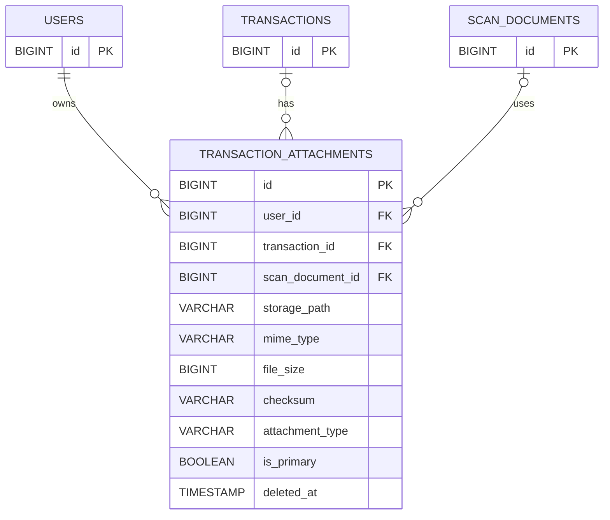

## 10.2 Aturan

- Attachment wajib memiliki `user_id`.
- Attachment dapat dibuat sebelum transaction final.
- Karena scan dapat dimulai sebelum transaction ada, `transaction_id` boleh null.
- Setelah scan dikonfirmasi, attachment dihubungkan ke transaction.
- Satu transaction dapat memiliki beberapa attachment.
- Satu attachment hanya memiliki satu file fisik.

---

# 11. Budgets

## 11.1 Diagram

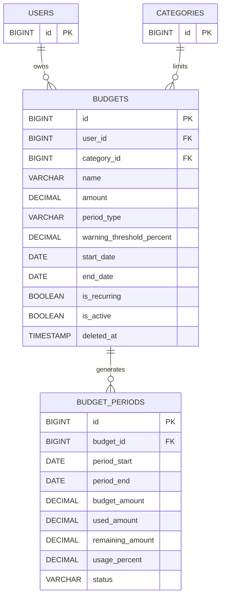

## 11.2 Cardinality

```text
users 1 : 0..* budgets
categories 1 : 0..* budgets
budgets 1 : 0..* budget_periods
```

- Satu budget selalu terkait satu expense category.
- Budget recurring menghasilkan banyak period.
- Budget custom dapat hanya menghasilkan satu period.

---

# 12. Scan and OCR

## 12.1 Diagram

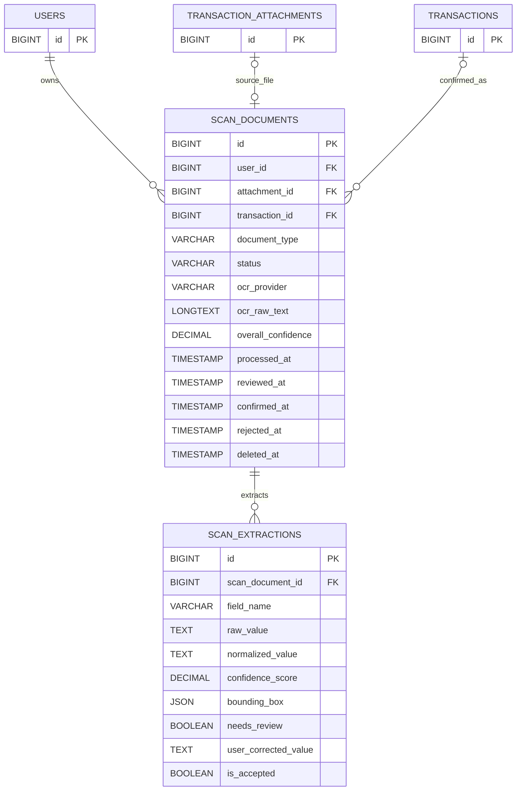

## 12.2 Cardinality

### scan_documents — scan_extractions

```text
scan_documents 1 : 0..* scan_extractions
```

Satu scan dapat menghasilkan banyak field:

- merchant.
- date.
- time.
- amount.
- admin.
- tax.
- total.
- reference.
- account source.
- account destination.

### scan_documents — transactions

```text
scan_documents 0..* : 0..1 transactions
```

- Scan draft belum memiliki transaction.
- Setelah dikonfirmasi, scan dapat menghasilkan satu transaction.
- Satu transaction dapat berasal dari satu atau beberapa scan, walaupun MVP biasanya satu.

---

# 13. Domain Activities

## 13.1 Diagram

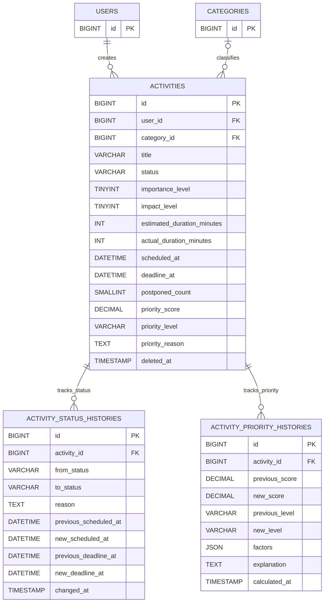

---

## 13.2 users — activities

```text
users 1 : 0..* activities
```

- Activity wajib dimiliki user.
- Single-user tetap menggunakan relasi ini.

## 13.3 categories — activities

```text
categories 0..1 : 0..* activities
```

- Activity boleh tanpa category.
- Category harus bertipe `activity`.

## 13.4 activities — status histories

```text
activities 1 : 0..* activity_status_histories
```

History dibuat saat:

- Activity dibuat.
- Dimulai.
- Selesai.
- Ditunda.
- Dijadwalkan ulang.
- Dibatalkan.

## 13.5 activities — priority histories

```text
activities 1 : 0..* activity_priority_histories
```

History dibuat jika:

- Score berubah.
- Level berubah.
- Faktor utama berubah.
- Scheduled recalculation menghasilkan perubahan berarti.

---

# 14. Domain Recommendations

## 14.1 Diagram

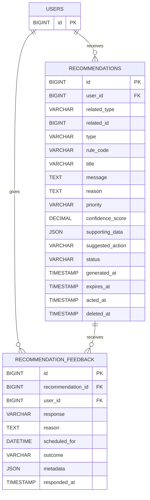

---

## 14.2 Polymorphic Related Object

Recommendation dapat berhubungan dengan:

- Activity.
- Account.
- Transaction.
- Budget.
- ScanDocument.
- User-level pattern.

Kolom:

```text
related_type
related_id
```

Contoh:

```text
related_type = App\Models\Activity
related_id   = 25
```

Untuk recommendation umum:

```text
related_type = NULL
related_id   = NULL
```

---

## 14.3 recommendations — feedback

```text
recommendations 1 : 0..* recommendation_feedback
```

MVP biasanya memiliki satu feedback final. Namun banyak feedback diperbolehkan untuk mendukung:

- Postpone lalu follow.
- Schedule lalu complete.
- Perubahan respons.

Feedback terbaru dapat dianggap sebagai state aktif.

---

# 15. Domain Notes and Notifications

## 15.1 Diagram

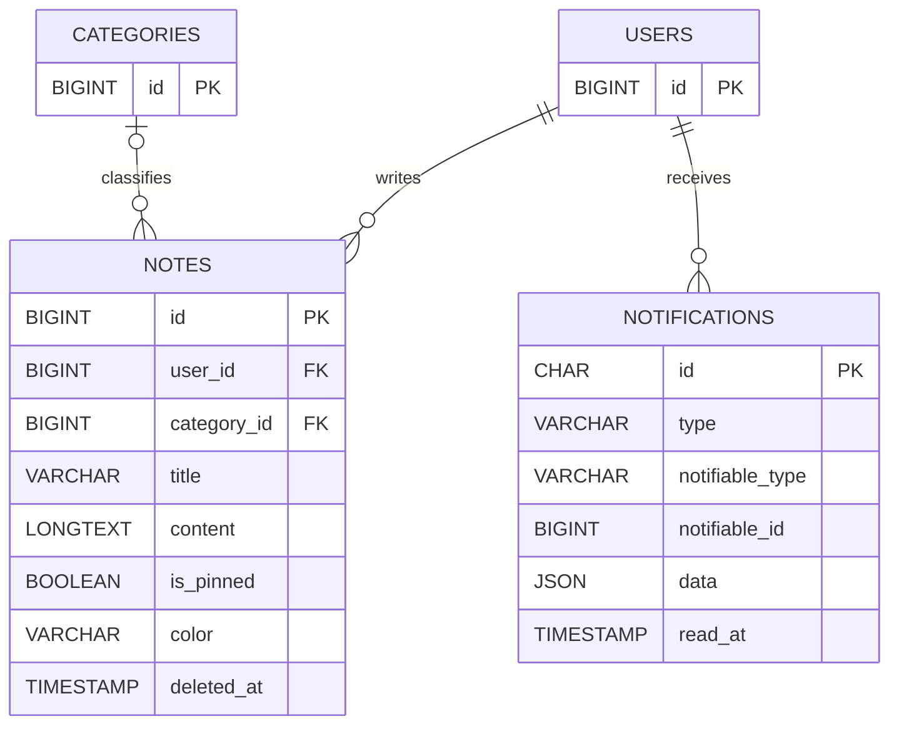

---

# 16. Domain Audit and Backup

## 16.1 Diagram

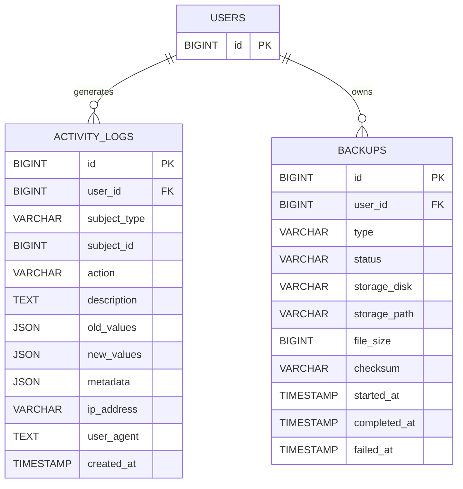

---

# 17. Polymorphic Audit Relation

`activity_logs` menggunakan:

```text
subject_type
subject_id
```

Dapat merujuk ke:

- Account.
- Transaction.
- Activity.
- Recommendation.
- ScanDocument.
- Budget.
- Note.
- UserPreference.

Tidak menggunakan database-level foreign key karena bersifat polymorphic.

Integritas dijaga oleh application service.

---

# 18. Relasi Eloquent yang Disarankan

## User

```php
public function preference(): HasOne;
public function onboardingProgress(): HasOne;
public function categories(): HasMany;
public function accounts(): HasMany;
public function transactions(): HasMany;
public function activities(): HasMany;
public function recommendations(): HasMany;
public function recommendationFeedback(): HasMany;
public function notes(): HasMany;
public function scanDocuments(): HasMany;
public function activityLogs(): HasMany;
public function loginHistories(): HasMany;
public function backups(): HasMany;
```

## Account

```php
public function user(): BelongsTo;
public function transactionEntries(): HasMany;
public function balanceSnapshots(): HasMany;
```

## Transaction

```php
public function user(): BelongsTo;
public function category(): BelongsTo;
public function entries(): HasMany;
public function attachments(): HasMany;
public function parent(): BelongsTo;
public function children(): HasMany;
public function scanDocuments(): HasMany;
```

## TransactionEntry

```php
public function transaction(): BelongsTo;
public function account(): BelongsTo;
```

## Activity

```php
public function user(): BelongsTo;
public function category(): BelongsTo;
public function statusHistories(): HasMany;
public function priorityHistories(): HasMany;
public function recommendations(): MorphMany;
```

## Recommendation

```php
public function user(): BelongsTo;
public function related(): MorphTo;
public function feedback(): HasMany;
```

## ScanDocument

```php
public function user(): BelongsTo;
public function attachment(): BelongsTo;
public function transaction(): BelongsTo;
public function extractions(): HasMany;
```

---

# 19. Relasi yang Tidak Digunakan

Beberapa relasi sengaja tidak dibuat langsung:

## accounts — transactions

Tidak ada `account_id` langsung pada `transactions`.

Alasannya:

- Satu transaction dapat memengaruhi lebih dari satu account.
- Transfer membutuhkan sumber dan tujuan.
- Fee dapat memengaruhi source account.
- Ledger lebih fleksibel melalui `transaction_entries`.

## transactions — source_account_id / destination_account_id

Tidak digunakan sebagai sumber kebenaran.

Informasi sumber dan tujuan diperoleh dari ledger entries.

Untuk kemudahan query, accessor atau query scope dapat dibuat.

## users — single account

Tidak digunakan karena user memiliki banyak account.

---

# 20. Foreign Key Summary

| Child Table | Foreign Key | Parent Table | On Delete |
|---|---|---|---|
| user_preferences | user_id | users | CASCADE |
| onboarding_progress | user_id | users | CASCADE |
| categories | user_id | users | RESTRICT |
| accounts | user_id | users | RESTRICT |
| transactions | user_id | users | RESTRICT |
| transactions | category_id | categories | SET NULL |
| transactions | parent_transaction_id | transactions | SET NULL |
| transaction_entries | transaction_id | transactions | RESTRICT |
| transaction_entries | account_id | accounts | RESTRICT |
| transaction_attachments | user_id | users | RESTRICT |
| transaction_attachments | transaction_id | transactions | SET NULL |
| budgets | user_id | users | RESTRICT |
| budgets | category_id | categories | RESTRICT |
| budget_periods | budget_id | budgets | CASCADE |
| activities | user_id | users | RESTRICT |
| activities | category_id | categories | SET NULL |
| activity_status_histories | activity_id | activities | CASCADE |
| activity_priority_histories | activity_id | activities | CASCADE |
| recommendations | user_id | users | RESTRICT |
| recommendation_feedback | recommendation_id | recommendations | CASCADE |
| recommendation_feedback | user_id | users | RESTRICT |
| notes | user_id | users | RESTRICT |
| notes | category_id | categories | SET NULL |
| scan_documents | user_id | users | RESTRICT |
| scan_documents | transaction_id | transactions | SET NULL |
| scan_extractions | scan_document_id | scan_documents | CASCADE |
| snapshots | account_id | accounts | CASCADE |
| login_histories | user_id | users | SET NULL |
| backups | user_id | users | RESTRICT |

---

# 21. Unique Constraint Summary

| Table | Unique Constraint |
|---|---|
| users | email |
| user_preferences | user_id |
| onboarding_progress | user_id |
| categories | user_id + type + slug |
| account_balance_snapshots | account_id + snapshot_date + source |
| budget_periods | budget_id + period_start + period_end |
| scan_extractions | scan_document_id + field_name |

Recommendation duplicate prevention dilakukan di service, bukan unique constraint statis, karena bergantung pada periode aktif.

---

# 22. Index Summary

## High-traffic Queries

### Dashboard

- Activities by status and deadline.
- Transactions by occurred_at.
- Accounts by user and active state.
- Recommendations by status.
- Transaction entries by account and effective_at.

### Finance

```text
transactions(user_id, occurred_at)
transactions(user_id, type, status)
transaction_entries(account_id, effective_at)
```

### Activities

```text
activities(user_id, status)
activities(user_id, priority_score)
activities(deadline_at)
```

### Recommendations

```text
recommendations(user_id, status)
recommendations(rule_code)
recommendations(related_type, related_id)
```

---

# 23. Data Ownership Rules

Semua query harus dibatasi dengan `user_id`.

Contoh:

```php
Account::query()
    ->where('user_id', auth()->id())
    ->findOrFail($id);
```

Walaupun single-user, jangan mengambil data hanya berdasarkan ID.

Aturan ownership:

- User hanya mengakses akun miliknya.
- User hanya mengakses transaksi miliknya.
- Entry diakses melalui transaction/account milik user.
- Attachment diakses melalui user_id.
- Scan diakses melalui user_id.
- Recommendation diakses melalui user_id.

---

# 24. ERD Validity Rules

ERD dianggap valid jika:

- Tidak ada transaction entry tanpa transaction.
- Tidak ada transaction entry tanpa account.
- Account dan transaction dimiliki user yang sama.
- Category sesuai dengan domain penggunaannya.
- Transfer memiliki minimal dua entry principal.
- Semua transaction final memiliki ledger entry.
- Draft tidak memiliki active ledger entry.
- Saldo account sama dengan initial balance plus ledger.
- Recommendation reason tidak kosong.
- Scan extraction hanya terkait satu scan.
- Budget menggunakan expense category.
- Default account preference milik user yang sama.

---

# 25. Transfer Integrity Rules

Untuk transaction bertipe `internal_transfer`:

1. Harus memiliki `transfer_group_uuid`.
2. Harus memiliki satu debit principal.
3. Harus memiliki satu credit principal.
4. Nilai debit principal sama dengan credit principal.
5. Account debit dan credit berbeda.
6. Admin fee opsional.
7. Fee hanya debit.
8. Total kekayaan berubah hanya sebesar fee.

Validasi dapat dibuat dalam:

```text
TransferService
TransferValidator
TransferIntegrityTest
```

---

# 26. Transaction Status and Entry Rules

| Status | Ledger Entry Aktif | Mengubah Saldo |
|---|---:|---:|
| draft | Tidak | Tidak |
| pending | Tidak | Tidak |
| completed | Ya | Ya |
| failed | Tidak | Tidak |
| cancelled | Tidak atau reversed | Tidak |
| refunded | Entry refund | Ya |

Jika completed transaction dibatalkan:

- Jangan hanya mengubah status.
- Buat reversal atau lakukan rekalkulasi terkontrol.
- Simpan audit trail.

---

# 27. Soft Delete and ERD Behavior

Soft delete tidak menghapus foreign key secara fisik.

Aturan:

- Transaction soft-delete tidak boleh meninggalkan saldo salah.
- Ledger entry harus di-reverse atau dikeluarkan dari perhitungan.
- Account soft-delete hanya setelah dinonaktifkan.
- Category soft-delete tidak menghapus data historis.
- Scan soft-delete tidak otomatis menghapus transaction final.
- Attachment soft-delete dapat menghapus file fisik setelah retention period.

---

# 28. Mermaid ERD Lengkap

Diagram berikut dapat digunakan sebagai referensi awal. Untuk visual final, disarankan memecahnya per domain karena ukuran diagram cukup besar.

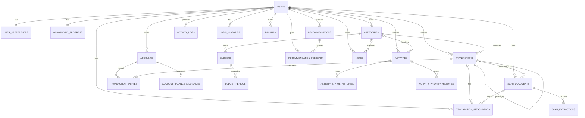

---

# 29. Diagram yang Harus Dibuat Secara Visual

Buat minimal enam diagram terpisah:

## 29.1 Core Identity ERD

- users
- user_preferences
- onboarding_progress
- login_histories

## 29.2 Finance Core ERD

- users
- accounts
- transactions
- transaction_entries
- categories

## 29.3 Finance Supporting ERD

- budgets
- budget_periods
- attachments
- snapshots

## 29.4 Activity ERD

- users
- activities
- categories
- status histories
- priority histories

## 29.5 Recommendation ERD

- users
- recommendations
- recommendation_feedback
- polymorphic related object

## 29.6 Scan ERD

- users
- scan_documents
- scan_extractions
- transaction_attachments
- transactions

---

# 30. Visual ERD Layout Recommendation

Untuk diagram final:

```text
Users berada di bagian kiri atas.
Categories berada di tengah.
Accounts dan transactions berada di tengah bawah.
Transaction entries berada di bawah transactions.
Activities berada di sisi kanan.
Recommendations berada di kanan bawah.
Supporting system berada di bagian luar.
```

Gunakan warna domain:

```text
Identity        : Biru
Finance         : Hijau
Activities      : Amber
Recommendations : Ungu atau biru sekunder
Scan            : Teal
System          : Abu-abu
```

Warna hanya untuk pengelompokan, bukan bagian dari skema database.

---

# 31. dbdiagram.io Starter Schema

Kode berikut merupakan starter dan dapat dikembangkan saat migration dibuat.

```text
Table users {
  id bigint [pk, increment]
  name varchar
  email varchar [unique]
  password varchar
  onboarding_completed_at timestamp
  is_active boolean
  created_at timestamp
  updated_at timestamp
  deleted_at timestamp
}

Table accounts {
  id bigint [pk, increment]
  user_id bigint [not null, ref: > users.id]
  name varchar
  account_type varchar
  initial_balance decimal
  initial_balance_date date
  cached_balance decimal
  minimum_balance decimal
  include_in_total boolean
  is_active boolean
  created_at timestamp
  updated_at timestamp
  deleted_at timestamp
}

Table categories {
  id bigint [pk, increment]
  user_id bigint [not null, ref: > users.id]
  type varchar
  name varchar
  slug varchar
  is_active boolean
  created_at timestamp
  updated_at timestamp
  deleted_at timestamp

  indexes {
    (user_id, type, slug) [unique]
  }
}

Table transactions {
  id bigint [pk, increment]
  user_id bigint [not null, ref: > users.id]
  parent_transaction_id bigint [ref: > transactions.id]
  category_id bigint [ref: > categories.id]
  transfer_group_uuid char
  type varchar
  status varchar
  source varchar
  main_amount decimal
  admin_fee decimal
  tax_amount decimal
  discount_amount decimal
  cashback_amount decimal
  total_amount decimal
  occurred_at datetime
  created_at timestamp
  updated_at timestamp
  deleted_at timestamp
}

Table transaction_entries {
  id bigint [pk, increment]
  transaction_id bigint [not null, ref: > transactions.id]
  account_id bigint [not null, ref: > accounts.id]
  entry_type varchar
  direction varchar
  amount decimal
  balance_before decimal
  balance_after decimal
  effective_at datetime
  created_at timestamp
  updated_at timestamp
  deleted_at timestamp
}

Table activities {
  id bigint [pk, increment]
  user_id bigint [not null, ref: > users.id]
  category_id bigint [ref: > categories.id]
  title varchar
  status varchar
  importance_level tinyint
  impact_level tinyint
  estimated_duration_minutes int
  actual_duration_minutes int
  scheduled_at datetime
  deadline_at datetime
  postponed_count smallint
  priority_score decimal
  priority_level varchar
  priority_reason text
  created_at timestamp
  updated_at timestamp
  deleted_at timestamp
}

Table recommendations {
  id bigint [pk, increment]
  user_id bigint [not null, ref: > users.id]
  related_type varchar
  related_id bigint
  type varchar
  rule_code varchar
  title varchar
  message text
  reason text
  priority varchar
  confidence_score decimal
  status varchar
  generated_at timestamp
  expires_at timestamp
  created_at timestamp
  updated_at timestamp
  deleted_at timestamp
}
```

---

# 32. Migration Validation Checklist

Sebelum migration dijalankan:

- Semua parent table dibuat sebelum child table.
- Foreign key type sama persis.
- Decimal memiliki precision dan scale yang benar.
- Nullable sesuai ERD.
- Unique constraint diterapkan.
- Index diterapkan.
- Soft delete tersedia.
- Cascade tidak menghapus data keuangan secara tidak sengaja.
- Circular foreign key dibuat terpisah jika perlu.
- Default account preference dibuat setelah accounts tersedia.

---

# 33. Eloquent Validation Checklist

- Semua relation return type didefinisikan.
- Fillable atau guarded aman.
- Cast enum tersedia.
- Cast decimal dipertimbangkan dengan hati-hati.
- Datetime cast tersedia.
- JSON cast menjadi array.
- Global scope user tidak digunakan secara berlebihan.
- Policy tetap digunakan.
- SoftDeletes trait ditambahkan.
- Transaction model tidak mengubah saldo melalui observer tersembunyi.
- Service menjadi pusat operasi finansial.

---

# 34. Testing ERD

## Relational Tests

- User memiliki banyak account.
- Account tidak dapat diakses user lain.
- Transaction memiliki entry.
- Entry wajib memiliki account.
- Transfer memiliki dua account berbeda.
- Category type sesuai.
- Activity history terhapus saat permanent delete.
- Recommendation feedback terhubung.
- Scan extraction cascade.
- Attachment tetap aman.

## Integrity Tests

- Tidak dapat menghapus account dengan entry.
- Tidak dapat menghapus transaction secara fisik jika memiliki entry.
- Tidak dapat membuat budget tanpa category.
- Tidak dapat membuat extraction tanpa scan.
- Tidak dapat membuat duplicate category slug per type.
- Tidak dapat membuat duplicate extraction field.

---

# 35. Acceptance Criteria ERD

ERD dianggap selesai apabila:

- Seluruh tabel pada database design tercakup.
- PK dan FK sudah ditentukan.
- Cardinality setiap relasi utama jelas.
- Finance menggunakan ledger entries.
- Transfer memiliki pola relasi yang benar.
- Parent transaction mendukung refund.
- Scan dapat dibuat sebelum transaction.
- Activity memiliki status dan priority history.
- Recommendation mendukung polymorphic relation.
- Category dapat digunakan lintas modul dengan type.
- Soft delete dan on-delete behavior jelas.
- Diagram Mermaid dapat dirender.
- Starter schema dbdiagram tersedia.
- Relasi Eloquent sudah didefinisikan.

---

# 36. Keputusan Final ERD

Keputusan final:

- `users` menjadi root owner seluruh data.
- `accounts` tidak berelasi langsung satu kolom dengan transaction.
- `transaction_entries` menjadi penghubung transaction dan account.
- Satu transaction dapat memengaruhi banyak account.
- Transfer menggunakan satu header dan beberapa ledger entry.
- Refund menggunakan self-reference transaction.
- Category menggunakan satu tabel dengan field type.
- Activity memiliki history terpisah.
- Recommendation menggunakan polymorphic related object.
- Scan document dapat berdiri sebagai draft.
- Attachment dapat ada sebelum transaction final.
- Audit log menggunakan polymorphic subject.
- Data finansial tidak bergantung pada observer tersembunyi.
- Integritas finansial dijaga service dan database transaction.

---

# 37. Tahap Berikutnya

Setelah ERD disetujui, tahap dokumentasi perencanaan inti selesai.

Tahap berikutnya adalah:

```text
Fase 1 — Fondasi Proyek
```

Langkah pertama pada fase tersebut:

1. Memastikan PHP, Composer, Node.js, npm, MySQL, dan Git tersedia.
2. Membuat project Laravel di folder `D:\Projects\laras`.
3. Mengatur `.env`.
4. Membuat database `db_laras`.
5. Mengatur timezone `Asia/Jakarta`.
6. Menjalankan project pertama kali.
7. Menginisialisasi Git.
8. Membuat commit fondasi.
